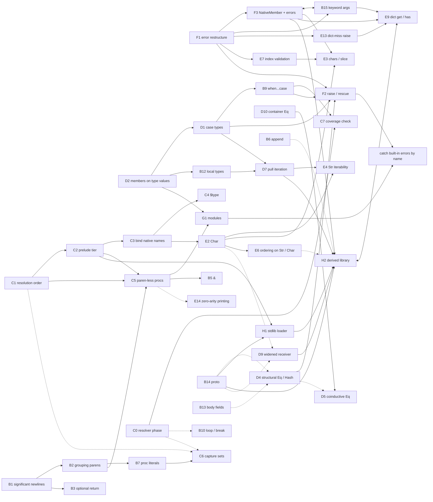

# Mesa roadmap

> **Archived 2026-10-03.** This document is no longer maintained. Its rules
> are not normative, and its progress markers were not kept in sync with the
> source, so a feature's status should be checked against the code.
> `doc/language.md` is the source of truth for the language and
> `doc/implementation.md` for the interpreter.

Extracted from `DESIGN_NOTES.md`, and **normative**: the rules an implementation
must satisfy are here, in §4. DESIGN_NOTES holds the reasoning behind them and is
where to go for *why*; §0 of that document remains the index of what is settled.
Section references (§) without a part number are to DESIGN_NOTES.

Four parts:

1. **[Settled but underspecified](#1-settled-but-needing-bikeshedding-or-further-specification)** — decisions taken whose spelling or mechanism is still open.
2. **[Settled work and what it requires](#2-settled-features-and-the-changes-they-require)** — every accepted-but-unbuilt item, with the changes the document names for it.
3. **[Dependency model](#3-dependency-model)** — what has to land before what.
4. **[Rules](#4-rules-for-the-routing-items)** — the normative content of the nineteen large items.

Nothing here is a new decision. Where this document adds an observation of its
own — a gap in §0's own lists, a dependency §0 doesn't state, or the `C1`/`C2`
split — it is marked *(not indexed in §0)* or *(derived)*.

**If §4 and DESIGN_NOTES disagree on a rule, that is a bug here.** Each §4 block
is stamped with the sections it was extracted from so it can be audited against
them. Nothing in §4 was written from memory.

## Marking progress

Rows carry a status marker so a reader can tell at a glance what is already
built. **Marking is additive — nothing is deleted when a marker goes on.**

| Marker | On a feature row (§2, §4) | On an open question (§1.1's L-threads) |
| --- | --- | --- |
| `[x]` | Implemented in the tree | Settled; the answer is recorded in the row |
| `[~]` | Partly implemented; the row says what is left | — |
| *(none)* | Not started | Still open |

The marker goes at the front of the row's first cell (`| [x] B8 | … |`) and at
the front of a §4 heading (`## 4.16 [x] F1 — …`), so `grep -F '[x]' ROADMAP.md`
lists everything done — `-F`, or the brackets read as a character class. Four
rules for applying one:

- **Delete nothing.** Not the changes-required text, not a §4 clause, and above
  all not a §3 edge. A landed feature keeps its dependency edges: they still
  record what had to come first, and other rows still reason from them.
- **Append the outcome, don't replace the description.** `**Done.**` at the end
  of a feature row — followed by a note on how it landed, where that is worth
  saying — and `**Resolved:** <the answer>` at the end of an L-thread's last
  cell. **No commit hashes.** They go stale under rebases and amendments, and
  the tree is where to look for how something is built; the marker records
  *that* it landed, not where. A `[x]` on `L4` means the question now has an answer written
  beside it, not that the question is gone.
- **§3 is not marked.** Waves and edges describe ordering, which does not change
  when an item lands. Status lives in §2 and §4 only, so there is one place to
  update and one place to trust.
- **If a feature landed in a form that differs from its row, amend the row and
  say so.** The row stays normative; a `[x]` beside a stale description is worse
  than no marker.

---

# 1. Settled, but needing bikeshedding or further specification

## 1.1 The live list (§0.4)

§0.4 is the document's only remaining open list, and after §24.7 none of it is a
correctness question. Nothing in it blocks anything *structurally* — but three
threads gate work rather than merely awaiting a bikeshed, and §3.2 carries them
as edges: **L1** (the protocol names) for `D7`, `B6`, `E6`, `E4` and `D6`, **L2**
(the step method's name) for `D7`, and **L12** (lazy or eager) for `H2`, the
derived library.

*(Four until §37, which closed **L3**, the sentinel. It was the only mechanism
thread among `D7`'s three, so what gates that row is now naming alone.)*

L12 is the one exception to "no correctness question here" being also "no work
waiting here": laziness and eagerness produce different library code, not the same
code differently spelled, so it wants settling before the library is written.

| # | Thread | Kind | Lives in | What is actually undecided |
| --- | --- | --- | --- | --- |
| [x] L1 | Names for the nine protocols, and the printing verbs | naming | item 2, §32.3, §25.1, §39 | The set is settled at nine (§32.1); no name is. Fans out into: equality, hashing, ordering, subscript, append, collection→iterator, iterator→step, display, debug — plus the two printing verbs (`show`/`inspect` are placeholders) and the subscript protocol's error name, which is not a separate decision and moves with it. §31.6 says all nine may be spelled out in full, since a protocol name appears about once per type declaration. **Done.** The nine are `Equal`, `Hash`, `Order`, `Access`, `Append`, `Iterate`, `Advance`, `Display`, `Inspect`, with verbs `display` and `inspect`; `Access`'s required verb is `access` and its
optional write verb is `store`. Settled by a rule rather than a bikeshed, which the row did not anticipate: §39.1 reads `impl X` as "supports being X'd", making a protocol name a verb whose *object* is the implementing type. That rejects nouns (`Subscript`, and `Item` after it) and verbs whose object is not the type — which is what removes **`Debug`**, since a value is never the thing being debugged. §31.6 supplies the other half and removes the truncations, so **`Eq` becomes `Equal`** and `Iter` becomes `Iterate`. Two amendments the row did not foresee. **`Equal` is an acknowledged exception**: equality's verb is homographic with its adjective, so no form passes §39.1, and it is taken on length alone so the set has no lone short name. And **the subscript error name resolves to nothing** rather than to a name — §20.2 already routes the declined half through the general `ProtocolError.NotImplemented`, so there is no subscript-specific variant left to name. **In the tree `NotScriptable` was renamed to `NotAccessible` anyway** rather than left to be superseded — it is still constructed today on a path the protocol does not exist to replace, and its message joins the `is not callable` / `is not iterable` / `is not orderable` family where a `Script` name was the one member named for notation. Interim consistency, not a permanent name. `L2` is deliberately left open (§39.4). **The AST node moved with it** (§39.6): `Expr::Script` is `Expr::Access` |
| L2 | The iterator step method's name | naming | item 10, §20.8, §24.5 | `next` became available again when item 21 dropped the keyword; taking it is explicitly *not* automatic |
| [x] L3 | Whether the exhaustion sentinel is `Maybe` | mechanism | §20.8, §18.5, §37 | Recorded as "plausibly" and never settled. **Resolved: no.** A step is a `Bool`, and the element it produced lives in a slot on the state object `D7` already allocates per loop — signal and value on separate channels, which is the property `Maybe.Some(nil)` versus `Maybe.None` was wanted for, at no allocation per element. §20.8 justified `Maybe` by an economy with §18.5's optionals; §37.3 declines the optionals as a second spelling of *absent*, so the economy was carrying the choice rather than supporting it. The cost accepted in exchange: reading the slot after a false is an invalid-state read, which a sum type would have made unrepresentable |
| L4 | Interpolation's spelling | naming | item 14, §22.6 | `"$(expr)"` against Ruby's `"#{expr}"`. Both dependencies are now settled — concatenation (§22.5) gives it a desugaring, §25 gives it a printing mode — so only the spelling is left |
| [x] L5 | The import keyword's spelling | naming | §27.3, §31.6, §38.7 | `impl` and `proto` are settled by the abbreviation rule; the import keyword is what's left of that thread. **Resolved: `import`.** §38 spends `module` and `export` alongside it — the largest single keyword spend since §20.5 drew the budget — and all three are written at the head of a file rather than in its body, so §31.6 calls all three infrequent and spells them all out. They are six characters each and read as one family; abbreviating any one to save a keystroke on a line written at most a handful of times per file would break the set for nothing |
| [x] L6 | Whether protocol signatures may carry defaults | mechanism | §31.2, §34.7 | And if so, whether implementors inherit or must repeat them. Inheriting is "a default body by the back door"; repeating is duplication the compiler could check. **Resolved:** a signature may carry defaults and implementors **repeat** them, checked at declaration. The back-door objection is void once §34 makes bodies the front door; repeating follows from §21.3 making a default part of the signature `B14` cl. 3 already requires the implementor to match |
| L7 | Conformance: operator or `$` builtin | mechanism | item 2, §31.3 | `x is Serialize` against `$protos(x)`. `$` costs nothing from the prelude budget; the operator reads better and spends a keyword or symbol. **Choosing also decides whether §17's parent membership becomes askable** — deliberately reopened in §31.3 |
| [x] L8 | Whether `Module` sits in the prelude | naming/budget | §28.1, §20.7, §38.8, §42.6 | Prelude (a tenth permanently-spent name) against an ordinary importable name in a built-in module, as `Error` and the protocols are. Nameable either way; the only use is a `$type` comparison. **§38 leaves this untouched** and says so: nothing in the package scheme needs the type named, and a package does not become a value — there is no `Package` type and packages are not in the namespace — so the question is exactly the one it was, against a larger module system. **Resolved: the prelude** — and by a rule rather than a budget argument, which is the shape §39.1 found for `L1`. §42.6 settles what the tier holds after §34.8's scaffolding expires — **the native types and nothing else** — and `Module` is then in it by construction: registered in Rust like `Type` and `Proc`, with no mesa declaration and, per §36.2, nowhere to put one. The row's alternative would need a mesa binding standing in for a Rust-registered type, splitting the native type names across two mechanisms for one member of the set — the trade §31.6 refuses elsewhere. Two amendments to the framing: the count is **ten rather than a tenth against nine**, since `Char` landed after §38.8 wrote nine; and the comparison to `Error` and the protocols no longer holds either, because those are exactly the names §42.6 moves *out* of the prelude, so the two halves of the question stopped being symmetric before it was answered |
| L9 | A word for the continue concept | naming | item 21, §24.5 | Deferred as a *feature*, not reserved as a name. Must be shorter and less common than `continue` |
| [x] L10 | `break` crossing a proc boundary | mechanism | §29.2, §24.5, §41 | Intended not to work; the mechanism is undecided. A lexical loop-depth check per proc body would make it a parse error needing no `Signal` variant — but that argument leaned partly on §16.2's escape prohibition, which §30 removed, so it is weaker than when made and wants re-examining. **Resolved: a lexical loop-depth counter over the body walk, reset at every proc body, carried by `C0` and raising `sem::Error`.** Depth zero is the error, which makes `break` outside any loop the same rule rather than a second one. The re-examination came out the other way round: §30 *strengthens* the prohibition, since an escaping closure may be called with no loop frame in existence at all, so the construct has no meaning to refuse rather than merely being refused. What §30 weakened is that the lexical rule now over-approximates — it also rejects the immediate callback, where a dynamic `break` would have worked — and §20.8's pull iteration is what leaves that population empty, since `each`'s body is a block in the enclosing frame and early exit in the derived library is a `return`. **Not the parser**, contra §33.2: the check raises `sem::Error`, and §41.2's rule is that a check lives in the module its error type names. Runtime is excluded by §4.7 cl. 6 rather than merely disfavoured. Precedent runs with this — Rust gives the closure case its own code (`E0267`), and Clang raises the loop case from Sema; only languages with a single static error bucket call it a syntax error. **Landed with `B10`**, which built `break` and `sem.rs`'s body walk together rather than splitting them across a separate `C0` session |
| L11 | A failure path for `NativeType.new` | mechanism | §29.4 | The same gap §29 closed for members. Inert until something constructible can fail — `Str(c)`, or `Str` from a list of `Char`s |
| L12 | Whether the derived library is lazy or eager | mechanism | §34.11 | *(new with §34.)* Lazy needs an adapter type per combinator — `B12` local types in the stdlib — and an interpreted step per element per stage; eager returns a `List`, whose native members mean a chain lands back on native ground after one stage. Eager allocates per stage and cannot express an infinite source. **The one thread here with work waiting behind it**: it gates writing the library, since the two shapes produce different code rather than differently-spelled code |
| L13 | Which combinators the derived library has, and their names | naming | §34.11 | *(new with §34.)* A list rather than a mechanism. Blocks nothing: a protocol may gain provided members later without breaking implementors |
| L14 | Whether a native type may implement a user protocol | mechanism | §36.2, §36.9 | *(new with §36.)* The first thread here that is a question about what users may write. `impl` attaches to a type declaration (§20.1) and native types have none, so `H2`'s seam declares their conformance in Rust — and that table is closed, which means `proto Json` can never be implemented by `List`. Declining is consistent with §0.1's no-reopening and with §27's no-visibility — which §38.5 reverses only at the package boundary, leaving the premise here intact, since export lists gate the reachability of names and never what you can see of a value you can already name. The fallback is a wrapper type, and adding a retroactive-conformance form later is additive to program validity. Blocks nothing; listed because it narrows the language and §36.2 asks for that to be deliberate |
| L15 | Whether a case parent's conformance may be discharged by its variants | mechanism | `D1`, `B14`, §31 | *(new with `G1` step 5d, found by running the shape rather than by reasoning about it.)* **`B14`'s row already asserts this works** — "one `impl` on a case parent serves every variant" is why `user_method` grew from two tiers to four. Lookup delivers that; the *check* does not. `impl Order` on a case parent whose variants each declare `compare` is rejected: `check_conformance` asks each type for its own members, a `case` item is not a method, so the parent's method set is empty and `MissingMember` names the parent. What works instead is `impl Order` on every variant, or a parent that declares `impl` *and* a default `compare` for its variants to override — so the valid spellings are the two that duplicate the `impl` line or supply a default nobody wants, and the one `B14` describes fails. The asymmetry is that conformance is checked downward while member inheritance also flows downward: nothing looks up from a parent to its variants, and discharging the requirement collectively is a different question from the one `check_conformance` asks — every variant must supply the member, and the parent supplies nothing. So the open part is narrow: whether the check relaxes to match `B14`'s intent, or `B14`'s sentence narrows to mean only that a parent's *acquired* members reach its variants. Not a lookup question either way — `G1` step 5d flattens each variant's members at declaration time and ranks a parent's declared member above a variant's acquired one, so the runtime shape is unchanged and only the accepted programs move. Blocks nothing structurally; `H1` meets it the first time an ordered stdlib type has variants |

## 1.2 Spelling deferred inside items §0 records elsewhere

| Thread | Lives in | State |
| --- | --- | --- |
| Proc literal spelling | §16.6, §0.2 | The *shape* is decided — name and parameter list independently optional, giving four forms — and §16.6 argues reusing `def` costs nothing against the keyword budget where a new word would. §0.2's row still reads "spelling deferred" |
| The spelling of `&` | item 27, §14.6 | §0.3's one item that is **settled-for-now and explicitly revisitable** rather than undecided. §14.8 clause 7 calls it "no longer provisional"; item 27 keeps it open |

## 1.3 Settled, with revision explicitly invited

These are decisions, not open questions. They are listed because the document
records the door as unlocked.

| Decision | Where | The invitation |
| --- | --- | --- |
| Arithmetic is not overloadable — *structure and access, yes; algebra, no* | item 13, §20 | "Open to revision if a real need appears." §19.3 pre-plans the consequence: `ArithNonNum` moves from `TypeError` to `ProtocolError` and nothing else changes |
| No reassignment of a constructor field in a type body | §26.3 | "Revisitable if it bites; a static constructor covers it meanwhile" |
| Proc literals capture with no marker or annotation | §30.5 | Adding one later is *breaking*, not impossible — correcting an overstatement made while deciding. The migration is mechanical: implement the annotation, make an unannotated capture a static error, fix the named sites |
| Zero-arity-only paren-less invocation | §15.1 | Significant newlines made paren-less *argument* calls expressible, so the restriction moved from forced to chosen. The lean is to keep it |
| No protocol composition — one `proto` may not require another | §34.5, §34.10 | *(new with §34.)* Declined for now, revisitable. Declining costs restated required verbs in the stdlib's protocol declarations plus duplicated default bodies where a derived protocol wants a prerequisite's *provided* member — author-side, invisible to users. Worth less in mesa than the Rust analogy suggests, since supertraits earn their keep through generic bounds and mesa has none. Adding it later is additive to program validity; **three preservations keep it free** and are normative in §4.5 cl. 18. Re-examine if the protocol set grows deep |

## 1.4 Deferred features — shape known, design not started

| Feature | Where | Note |
| --- | --- | --- |
| String interpolation | item 14, §22.6 | Only the spelling is left (L4) |
| `Range`, and `s[0..3]` for substrings | §22.6, §23.1 | Replaces §22.4's `slice`. §23.1's reserved negative indices land here, which is what keeps negative indexing a pure extension |
| Opaque `Bytes` type | §22.6 | Byte access waits for it, rather than `str.bytes` as a `List` of `Num` |
| Modulo `%` | §23.1 | "A decision not to decide," cheap because nothing is designed around its absence |
| The continue concept | item 21, §24.5 | Feature deferred, nothing reserved (L9) |
| General value dispatch (`case`/`switch`) | §6.1, §13.2 | Held; §17.5's type dispatch removed most of its motivation rather than reshaping it |
| A sequence/collection protocol | §32.2 | "Deferred rather than declined." The forcing case — views interchangeable with `List` — is itself behind `Bytes` |
| Concurrency | item 26, §24.1 | Mesa is a blocking language, decided rather than merely absent. Threads later mean `Rc`→`Arc` and `RefCell`→lock: expensive, mechanical, no semantic change |
| Generators (iterators-as-coroutines) | §37.6 | *(new with §37.)* Carried with a **revisit condition** rather than as an open design: reconsider **if the evaluator ever moves to explicit heap frames for another reason**, which is what makes suspension cheap and nothing else does. Today `eval_expr`/`eval_block` recurse on the Rust stack, so a generator needs a thread each, a stackful coroutine per loop, or an evaluator rewrite. They would remove the hand-written slot-and-flag that `L3`'s rejected two-verb form required of every streaming iterator, and they are orthogonal to the sentinel: Python has `yield` *and* `StopIteration`, so this would not have decided `L3`. `D7`'s step verb is already shaped like a resumption boundary, so nothing here has to be reserved now |
| Single-pass sources against re-iterable collections | §37.6 | *(new with §37.)* §4.15 cl. 1 splits collection from iterator so a collection can be iterated twice; a file is not a collection, and nothing records what `File.lines` returns or what a second loop over a spent source does. Named rather than designed — Python's silent empty-second-loop is the failure to avoid. Independent of `L3` and of generators, though generators would make one-shot sources ordinary |
| Traceback preservation across re-raise | §5, §13.3 | A caught error stored and re-raised gets the re-raise site unless `raise` is built to carry the original. Deferred deliberately; distinct from the traceback item in §0.2 |

## 1.5 Specification threads the reasoning sections raise that §0 does not index

*(not indexed in §0 — recorded here because they are live questions inside
settled work.)*

| Thread | Where | The question |
| --- | --- | --- |
| `NameError` versus `UnboundIdent` | §19.2, §38.4 | §0.1 lists the seven groups with `NameError` among them, so §0 reads it as settled. §19.2 says the name is "deferred rather than adopted… left open regardless, to be settled with the module spec (§10)," where "names in a module" and "names in a scope" acquire a precise distinction the error should match. **§0 is authoritative; flagged because the reasoning section disagrees with it.** **The deferral condition is now discharged** *(new with §38)*: §38.4 draws exactly that distinction — a bare identifier that resolves against nothing is a **scope** failure, while `JsonRpc.nope` is a **member** failure that §28.2's `MemberError` family already covers — so the two are different errors about different mechanisms, and the scope one may take the narrower name. §38.4 records this as *now-decidable rather than decided* and hands the §0-versus-§19.2 conflict to this table to close, which makes it the one row here with an owner rather than only a question |
| Uniform iteration dispatch versus cheap native loops | §20.8 | Pull iteration allocates a state object per loop, on the most common construct in the language. `Expr::Each` can special-case `Obj::List` cheaply, but doing so re-creates the two-path split protocols were meant to collapse. "Uniform dispatch or cheap native loops; probably not both" — unresolved |
| `!=` as the one symbol-spelled negation | §4 | Mesa spells connectives as words (`and`, `or`, `not`) and comparisons as symbols. `!` exists only inside `!=`. Lua chose `~=`; Ruby carries both. "Worth picking on purpose, and this question is raised only here — §0.3 never picked it up" |
| Diagnostics for the declare-before-the-block discipline | §3.2, §13.5 | Proposed, not accepted: when `UnboundIdent` fires for a name assigned inside an inner block earlier in the same proc, say so. Computable from the AST with no new semantics, and the only mitigation left once declaration syntax was declined |
| ~~Whether modules group into a larger unit~~ | §28.4, §38.1 | **Closed by §38: they group into packages**, and a package — a whole library, as a crate or a gem is — is the unit of compilation, evaluation, and distribution. §28.4's acyclic rule survives at two grains, and §33's resolver widening to the package makes declarations order-independent within it, refunding §28.4's "mutually recursive types have to share one module" |
| Filename correspondence as a lint | §38.3, §38.8 | *(new with §38, which says in as many words that it "has no row anywhere.")* Nothing in the mechanism needs one: names are declared rather than derived, so `src/stuff.ms` declaring `module JsonRpc.Codec` checks out fine. But a reader browsing the repository then cannot find a module by its name, which is the visual-cohesion cost the scheme otherwise avoids. **A lint is the right home**, since any rule strict enough to be an error is the case-mapping rule the lowercase constraint exists to avoid, and `src/package.ms` would need a permanent carve-out either way. A diagnostics question rather than a language one, which is why it sits here rather than in §0 |
| How the fixtures become packages | §42.2, §42.9 | *(new with §42.)* Every program is a package: a bare `mesa foo.ms` script mode would need a name from nowhere (§38.3), a synthetic root §38.2's pairing rule does not describe, and a second entry shape for the loader forever, so **declining it is settled**. What is not is the landing on `tests/*.ms`, whose 32 fixtures are single files run one process per case, and on `main.rs`, which must find `package.toml` rather than take a path. The pieces in tension: a `module` header shifts every `#!` line number unless the harness writes it onto a line the fixture already spends on a comment; expectations name the source file, so the path in every error fixture changes; and writing each case as a *child* module to preserve those filenames would route all 32 tests through `G1`, so a module regression fails the whole suite instead of the module tests. A harness question rather than a language one, which is why it sits here — and the scheme is not load-bearing, so replacing it outright is on the table. **Discharged in the tree** *(new with §45's plan step 2)*: none of the three tensions survived contact. Commit 62be107 had already removed file names and line numbers from expected output, so the header's line shift is invisible and no expectation names a path; and rather than writing each case as a child module, the harness synthesizes the package *around* the fixture — `package.toml` plus `src/package.ms` carrying a generated `module Test` header, into the per-case temp directory it already created. **No `.ms` fixture was edited**, and a module regression fails the module tests rather than all 32 |
| Cl. 11's second layout invariant | §38.2, §45.7 | *(new with §45.)* "`src/` holds exactly one file that no directory pairs with" has no enforceable form yet distinct from "`src/package.ms` exists". A file with no paired directory is ordinary and legal — `transport.ms` in §38.2's own tree has none — so the clause cannot mean what its sentence most readily suggests, and what it is really asserting is `package.ms`'s exceptional status as the one declaring file sitting *inside* its own directory rather than beside it. A spelling question rather than a design one, and it belongs to whoever writes the layout family |
| Grouping-paren tiebreak after `def` | §16.6, §15.1 | Decided in shape: "a `(` on the same line as `def` is a parameter list." Recorded here because it is a rule that only comes due when grouping parentheses land, and it lives in §16.6 rather than in §0 |

---

# 2. Settled features and the changes they require

Every row of §0.2's table, regrouped by area, with the changes the document
names. IDs (`B1`, `E7`, …) are this document's, for use in §3.

§0.2's own framing: "Nothing here depends on an open question any longer, and
none depend on each other except where noted." Five rows want a protocol
**named** rather than designed — `D7`, `B6`, `E6`, `E4`, `D6` — and that naming
is thread L1 above.

### How to read a row

**A `[x]` or `[~]` in the ID cell is status, not content** — see *Marking progress*
above. It says the row has landed (or partly landed); the row's text still
describes the feature, and §3's edges still hold.

**Rows without a ⇒ are self-sufficient.** The changes described are the whole
change; act from the row. Their § references are citations for the reasoning,
worth following if you want the *why* and not otherwise.

**Rows marked ⇒ have a rules block in §4.** The row gives the shape and the
touchpoints; §4 gives the rules a correct implementation has to satisfy. Nineteen
of the fifty-five rows are marked — the large features, where the row alone would
leave you under-implementing.

If you do go to DESIGN_NOTES for the reasoning, one hazard: it is layered and
self-reversing. §30 reverses §16.2, §24.5 refunds a keyword §20.8 had priced as
lost, §32.2 moves `NotCallable` out of the group §19.3 put it in. A section read
in isolation may state a rule a later section overturned, so read the *amended*
notes inside it rather than stopping at its first statement. §4 already resolves
these; it states the current rule, not the original one.

## 2.1 Diagnostics and process behaviour

| ID | Item | Changes required |
| --- | --- | --- |
| [x] A1 | Non-zero exit status on error (§5) | `main.rs` currently prints to stderr and falls off the end of `main`, so a failing script exits 0. Small and unambiguous. **Done.** |
| [x] A2 | Call-location traceback (§5) | A `Vec<Location>` pushed as frames unwind. `eval_proc_call` has the call-site `Token` in hand and discards it. §5 calls this the best value-per-unit-of-work in the document; §13.3 argues `rescue` makes it *more* valuable, not less; §18.7 raises its value again, since raising accessors arrive before recovery does. **Done.** Landed as `Signal::Error(Error, Vec<(String, Location)>)` |

## 2.2 Lexer and parser surface

| ID | Item | Changes required |
| --- | --- | --- |
| [x] B1 | Significant newlines (§15) | One `nl_before: bool` on `Token`, stamped in `lex_next`'s existing whitespace/comment loop (the flag must survive comment skipping). One `TokenTag` → property table shaped like `Precedence::of`: `Ident`, `Str`, `Num`, `Bool`, `Nil`, `RParen`, `RBrack`, `RBrace`, `End` terminate; everything else continues. Consulted only in `parse_expr_prec`'s postfix/infix loop. `return` is a special case and terminates at a newline (§15.4). No existing fixture relies on the current behaviour | **Done, in an amended form.** `nl_before` did not land on `Token`: `Nodes<Node, Id>` (the `Decl`/`Expr`/`Block` arena) stores one full `Token` per AST node purely for `Location` recovery, so a field added to `Token` is paid for by every node permanently, not just by the transient token stream. Landed instead as a `nl_befores: Vec<bool>` parallel array held directly on `Tokens` (not returned alongside `Vec<Token>` as this row previously said), read through `Tokens::nl_before` and consulted in `parse_expr_prec`'s postfix/infix loop exactly as the row specifies. The `terminates_expr` table matches the row's set exactly (though the row's
own listing omits `Char`, which the table has carried since `Char` landed).
**Amended by DESIGN_NOTES §40:** the rule was one-sided by construction —
`nl_before` was only ever tested against the token *before* the newline, so
trailing continuation (`a +` newline `b`) already worked and only leading
continuation (`a` newline `+ b`) was rejected. §40 adds a second table,
`continues_expr`, and a third conjunct so a newline no longer breaks the
chain when the *following* token is one of twelve infix-only tags (`or`,
`and`, `==`, `!=`, `<`, `>`, `<=`, `>=`, `+`, `*`, `/`, `.`). `-`, `[`, `(`,
and `:=` are deliberately excluded — the first three because each also has a
prefix-position job a newline can't safely disambiguate, `:=` on taste alone
since it is otherwise safe. `return`'s special case (§15.4) is untouched. |
| [x] B2 | Grouping parentheses (§14.8) | `parse_expr_unit` has no `LParen` arm at all; `(a + b) * c` is currently unwritable. Landing it makes `def render (a + b) * c end` ambiguous, resolved by §15.1's same-line rule. **Done.** |
| [x] B3 | Optional `return` operand (§9) | `parse_return_expr` always parses an operand. Needs §15.4's special case (`return` terminates at a newline) or it recreates JavaScript's `return` hazard. **Done.** |
| [x] B4 | `?` and `!` in names (§31.5) | Lexer: consume a trailing `!` into the identifier **unless** it is followed by exactly one `=`; `?` unconditionally. Two characters of lookahead, which the lexer already does for `<=`, `>=`, `!=`, `:=`. Suffix only, and not on type names. **Done.** |
| [x] B5 | `&` (§14.3) | **⇒ rules: §4.1.** Prefix parsing now exists (`not`, unary minus, `parse_unary_expr`), so `&` inherits the infrastructure. One qualification: `&` *suppresses* its operand's auto-invoke rather than applying an operation, so it wants its own node or a special-cased `UnaryOp` — the parse shape is shared, the evaluation shape isn't. Binds looser than `.` **Done.** Landed as its own node, `Expr::Mention`, not a `UnaryOp` variant — `Not`/`Neg` share the invariant "evaluate the operand, then apply an operation," and `&` breaks both halves. `TypeError::NotInvokable`, added ahead of time by §32.2 and dead since, is now live and needs no change. The callee-position dispatch `Expr::Call` already had (`Name`/`Member` resolved raw, else `eval_expr`) turned out to be exactly `&`'s suppression rule, so it was lifted into `eval_expr_raw` and both consumers share it, alongside the existing `eval_name_raw`/`eval_member_raw`. One thing this surfaced that §4.1's clause 1 undersells: "however the name resolves" applies to locals too, not just members, so an identity proc must read its own parameter as `&val` — bare `val` auto-invokes it under §4.8 cl. 1 the moment the argument passed in is itself a proc. `tests/procs.ms` came back as `$print(id(&id))` with `id`'s body as `&val`, not bare `val` — the call-site `&` alone isn't enough to round-trip. |
| [x] B6 | `<<` append operator (item 16) | A `TokenTag`, two-char lexing beside `<` and `<=`, a **left-associative** `Precedence::of` mapping, and ~~a protocol name (L1)~~ **the protocol `Append` (§39)**, the placeholder having survived the naming rule unchanged. Evaluates to its receiver (§24.3), which is what makes `l << 1 << 2` chain — and the protocol must require that of user implementations rather than leaving it to convention. **Done, in an amended form.** `TokenTag::LtLt`, lexed beside `<`/`<=`, and `Precedence::APPEND` sit exactly as specified, one level below `ADD`. `Append` evaluates to `lhs` unchanged, and because `Val::Obj` wraps an `Rc<RefCell<Obj>>`, mutating in place and returning it is what makes the chain hold. What did not land: dispatch through an actual `Append` protocol, since `B14`'s `proto` mechanism doesn't exist yet — `BinaryOp::Append` checks for `Obj::List` directly, the same stopgap `NotIterable`/`NotAccessible` already use elsewhere for their protocols. `ProtocolError::NotAppendable` is in place as the error variant, so the row's naming half is honored even though the protocol itself is not yet a real conformance target |
| B7 | Proc literals (§16) | **⇒ rules: §4.2.** An `Expr` arm, plus a `Proc` that carries its capture set rather than a reference to the enclosing scope (§30 reversed §16.2's by-reference design). Four forms, from two positions (declaration, literal) crossed with an optional parameter list — a literal is never named, so a leading `Ident` after `def` in expression position begins the body. Spelling deferred |
| [x] B8 | `else when` chaining (§13.2 option A) | One branch in `parse_when_expr`: when parsing the `else` branch, if the next token is `when`, parse a nested `when` as the entire else-block and do **not** consume a second `end`. No new keyword, no AST change, no runtime change. **Done.** |
| [x] B9 | `when … case` matching (§17.5) | **⇒ rules: §4.11.** One branch in `parse_when_expr` where there is currently an unconditional `take(Then)` — parse `when`, an expression, then peek: `then` is the conditional, `case` is a match. LL(1), no dependence on significant newlines. No binding form is needed: inside an arm the variant is known, so `e.name` is ordinary member access. **Done.** Landed as `Expr::Match(Match(ExprId, Vec<Arm>, Option<BlockId>))`, `Arm(ExprId, BlockId)`, arms inline in a `Vec` the way `Call`'s `Vec<Arg>` already is — no new arena id. Arm paths are a restricted grammar, `Ident` then `.Ident`* (reusing `parse_name_expr`/`parse_member_expr`), so `case f() then` is a syntax error rather than a semantic one, keeping §4.11 cl. 6 literal in the grammar. Arms match on **exact** `type_id` equality — per cl. 9 there is no parent-membership test, so `case Expr then` (a case parent) never matches a variant — evaluated lazily in order, first match wins; no arm and no `else` yields `nil`, exactly as bare `when` does. A path expr that doesn't resolve to a type is `TypeError::CaseNonType`, the one addition to `F1`'s settled taxonomy this forced. Coverage/dead-`else` checking is explicitly out of scope, staying `C7`'s |
| [x] B10 | `loop do … end` and `break` (items 20, 21) | Two keywords, and one `Signal` variant carrying a `Val` — `break x` makes the loop an expression, bare `break` yields nil. No new machinery class. `next` is **not** built. **`L10` closed by §41**: a misplaced `break` is a `sem::Error` from `C0`'s body walk, on a lexical loop-depth counter reset at every proc body, with depth zero covering `break` outside any loop. Two consequences for this row. The `B7` edge is retired — a `def` body is as much a boundary as a literal — and replaced by a soft `C0` edge, so `break` may be built first and the check added with the body walk. And **`Signal::Break(Val)` must be unrescuable**: `break` inside a `rescue` arm inside a loop is legal by the counter, so `F2`'s machinery has to let the variant through untouched rather than catch it. That is the one rule the new variant introduces and it is recorded nowhere else. **Done.** `L10`'s check landed in this same session rather than waiting on a separate `C0` pass — a stray `break` reaching `Interpreter::eval` as an uncaught `Signal` has no defined behaviour, so shipping without it wasn't an option. `sem.rs` gained its first expression traversal (`walk_expr`/`walk_block`, exhaustive over every `Expr` variant) to carry the depth counter. One rule this row didn't anticipate: `return`'s optional-operand check (`nl_before`) is **widened** to "newline, or the next token can't start an expression at all" and shared between `return` and `break` via one `starts_expr` helper — this is what makes `when done then break end` parse as a bare `break` rather than a syntax error, and retroactively makes `when n == 1 then return end` legal too (previously an untested corner, since every existing `return` fixture put a newline after the keyword). Fixed a latent bug along the way: `each`'s `Obj::Dict` branch built one `Scope` before the loop and reused it across iterations, while the `Obj::List` branch built a fresh one per iteration — the dict branch now matches the list branch, and `loop` follows the same fresh-per-iteration rule |
| [x] B11 | Static methods (§21.1) | **⇒ rules: §4.3.** `def self.name(…)`, reached as `Amount.of_dollars(…)`. Needs `self` as a real `TokenTag`, since the parser must recognise it immediately after `def` — which closes item 28 and makes `self := 9` a syntax error. Lives in the same type-member namespace as variants and nested types. A static is *not* among an instance's members, so bare `of_dollars(…)` inside an instance method does not resolve; qualification is required. **Done.** |
| [x] B12 | Local types (§21.2) | The parser already accepts `type` inside `type`; `rt.rs:569` is a `todo!()`. Needed by §20.8's iterator structs |
| [x] B13 | Body fields (§26) | **⇒ rules: §4.4.** `UserType` gains a second field list plus their initializer `ExprId`s, evaluated after the constructor fields bind, in declaration order. A parser arm for `Ident :=` in a type body, which gives `rt.rs:579`'s `todo!()` a meaning and makes a bare expression there a syntax error. Resolver check rejecting rightward references (§24.4's rule, unchanged). Body fields sit between variants and methods — the only ordering constraint a type body has. A case-type parent cannot have them. **Done.** |
| [x] B14 | `proto` declarations (§31.1, §34) | **⇒ rules: §4.5.** A `Decl` arm; `def` members inside, **each closed by `end`**, the protocol closed by `end`; conformance recorded on `UserType` by `impl`. Signature checking compares parameter **names**, not counts, because §21.3 makes names public API. **§34 reverses the no-default-bodies rule**: an empty body means required, a non-empty body means provided and implementors acquire it, and the per-member `end` is what keeps that decidable. Adds a body-scope restriction, a conflict rule, and an override rule — all declaration-time checks, all clauses on the conformance job rather than a new one. **Done.** `proto` and `impl` are keywords; `ModuleItem::Proto` holds its members in a `proto_items` arena, and `Type` carries a `Vec<Sym>` of implemented names parsed from one optional `impl` line at the head of the body — position enforced by the grammar, so a later `impl` does not parse. Required-vs-provided is never stored in the AST: it *is* the member's block being empty, read at each of the three places that ask. The six declaration-time checks and §34.4's reach check live in `sem`, per §41.2. **Protocols are values** (cl. 9's prerequisite): `proto P` binds `P` as an `Obj::Proto` in the declaring scope and `impl P` resolves it through the ordinary scope chain, which is what will carry conformance across §38's module boundaries with no second, name-keyed resolution path. **L7 itself is untouched** — no `x is P`, no `$protos(x)` — so it is now purely additive. Four amendments the row did not anticipate. **`proto` is the language's first order-independent declaration** (§38.1), by a pre-pass in `sem::check` and another in `rt::eval`, because `impl` is the first construct that consumes a name at declaration-evaluation time; `type` and `def` are still top-down. **`Proto` joins `CORE_TYPES`** as a tenth core type so the new `Obj` has a `TypeId`, which makes `Proto` a permanently unshadowable prelude name alongside `Type` and `Proc`. **One `impl` on a case parent serves every variant**: `TypeRegistry::user_method` grew from two tiers to four — methods declared here, a parent's if this is a variant, members acquired from a protocol, then a parent's acquired — since a case parent is non-constructible and its variants are the only instances that exist. And **signature agreement is checked on overrides too**, not only on required members, so a type overriding a provided `min(other)` with `min(x)` cannot silently break the keyword-argument API cl. 3 exists to protect. Three narrowings, recorded rather than hidden: cl. 12 is enforced for `self.x` and **not for a bare `x`**, which still reaches an implementing type's field through the implicit-`self` fallback — completing it needs the binder tracking `C2`'s prelude check is also waiting on; cl. 10's default comparison compares **presence always and values only between literals**, treating a non-literal default on either side as agreeing; and `sem` resolves `impl` names syntactically against the chunk while `rt` resolves them through scope, so a top-level binding shadowing a protocol name between the pre-pass and the type declaration is caught at runtime by the new `TypeError::NotProtocol` rather than at declaration. **No built-in protocol is declared against the mechanism yet** (`D4`, `D6`, `D7`, `E6`, `B6`), and native types still cannot implement one (`H2`/§36's seam, L14) |
| [x] B15 | Keyword arguments + defaults (§21.3, §24.4) | **⇒ rules: §4.6.** Any parameter passable by name — one token of lookahead, a bare `Ident` followed by `:` in argument position. Defaults evaluate **per call** in parameter declaration order and may reference parameters to their left; call-site arguments evaluate left to right in written order; a rightward reference is a declaration-time error. Fields take defaults too. Amends §14.8 clause 1 to *zero **required** arity*. `NativeMember`'s fixed `arity: usize` becomes a range — the same struct `F3` folds, so **the two want one pass over `CORE_TYPES`**. §19.3 gains an `ArgumentError` group of four (`Missing`, `TooMany`, `Unknown`, `Duplicate`), retiring `WrongArgCount`, whose `(want, got)` payload cannot survive arity becoming a range. **Done**, except cl. 5's rightward-default check, which `C0` now owns — it needs scope tracking the pass does not have, and a naive walk rejects valid programs (same wall as `B13`'s body-field check). Two rules §4.6 did not state were settled and added as cl. 11 and cl. 12: positionals precede keyword arguments, and required parameters precede defaulted ones. Cl. 9's `Missing` carries every unfilled name rather than one. `F3`'s deferred parameter-names half (§36.3) landed here, and native member access stopped invoking inside `Member::get`, which is what finally gave `C5`'s callee-position seam reach over natives — see those rows |

## 2.3 Names, scope, and resolution

| ID | Item | Changes required |
| --- | --- | --- |
| [~] C0 | The semantic analysis phase (§33, §35, §38) | **⇒ rules: §4.7.** A pass between `Parser` and `Interpreter`, consuming `Chunk` and producing side tables keyed by `ExprId`. Two sub-passes: collect declarations, then walk bodies. Per module, in import-DAG order once `G1` exists — **widened by §38.1 to the package**, which splits that ordering in two: declarations resolve package-wide and are order-independent, and only top-level evaluated bindings need the DAG. Its own error type, not rescuable. Hard-forced only by `C7`; `C6` wants it for efficiency; the other seven jobs can live in `eval_decl` until it exists. **Named by §35**: the *phase* is semantic analysis and the *pass* below is the resolver, one of its four carriers alongside the parser, the loader, and `eval_decl`; the error type is `sem::Error`. The row builds the pass — the phase exists in scattered form as soon as the first of its checks does, so the checks landing in `eval_decl` beforehand are this row partly built rather than work to redo. Two of them are also *partial* there rather than merely early (§4.7 cl. 13): `C2`'s prelude prohibition and `B15`'s rightward-default check cannot reach bindings and proc literals inside bodies, so this row completes them rather than relocating them. **Partly done** — the pass exists, in `src/sem.rs`, running between `Parser` and `Interpreter` and carrying `sem::Error` with clause 5's shape and clause 11's `file:line,col: semantic error: …` `Display`. It was pulled forward ahead of `C7` (which is what clause 9 says forces it) because `C2`'s check wanted a home that was not `eval_decl`; see that row. **What is left:** everything the pass does beyond one check. No side tables, no `ExprId` keys, no slot assignment, no capture sets — clause 4's three outputs are one output, diagnostics. It is a single traversal of `chunk.top`, not clause 2's two sub-passes, which stays correct only while the one check reads declaration *names* and nothing reads a declaration made later in the file; `C7` is what forces the split. Clause 3 is untouched (one module until `G1`, and one package after §38 widened it). Of clause 9's jobs, only the prelude prohibition is in it — plus §4.6 cl. 12, **required params precede defaulted ones**, which `B15` added and which is not on clause 9's list at all. `B15`'s **rightward-default check did not land**, contra clause 13's expectation of a partial one: it needs the scope tracking this pass does not yet have, and without it a naive walk rejects valid programs. That is a second obligation waiting on this row, alongside `B13`'s body-field forward-reference check, which stalled on exactly the same thing. **Amended by §41**, which promotes the reason `C2` was pulled forward into a rule and gives this row a tenth job. *The rule:* a check lives in the module its error type names (§41.2), so no `sem::Error` is ever raised from `rt` or `syn`. That voids the "can live in `eval_decl` until it exists" allowance in this row's third sentence and in clause 9 — the deflated seven have nowhere else to go — so the thing forcing this row into existence is the *first* obligation implemented rather than `C7`, which is what already happened. Clause 12's carrier freedom narrows to carriers inside `sem`, and §35.1's four carriers become two: this pass and the loader, both in `sem`, which is named for the phase and not for resolution. *The tenth job:* `L10`'s `break` check, moved here from the parser by the same rule. It is **the first obligation that walks a body** — `check_def` currently discards its body, so it forces the first exhaustive match over `Expr`'s fourteen variants outside `syn.rs` and `rt.rs`, and every future variant adds an arm. That traversal is what `C6` and `C7` then hang on, and it is what completes clause 13's two partial checks. It does **not** unblock `B15` cl. 5 or `B13`: those need an *environment* (what a name resolves to) and `break` needs only a traversal and an integer, so `L10` makes them reachable rather than cheap — the scope chain is still `C1`'s. One thing to size before the body walk lands: `sem::check` returns on the first error, which is fine over `chunk.top` and starts costing diagnostics once it walks bodies across a package; `Vec<Error>` is a signature change worth making once. **Amended by `B14`, which forced clause 2's split ahead of `C7`**: `check` is now two traversals of `chunk.top` — one collecting declarations and running the prelude check, one walking types, protocols, defs and exprs — because `impl P` may name a `proto` declared further down the file, which is exactly the "nothing reads a declaration made later" condition this row named as what kept one traversal correct. The collected environment is one map, `Sym → &Proto`, not clause 4's side tables, and it lives for the call rather than being an output; the sentence above about `C7` forcing the split is superseded on the *when*, not on the *why*. **Amended by §44**, which promotes that environment to an output and fixes what the phase may build. *The rule (§44.1):* clause 7 governs construction as well as inspection, so the phase produces descriptions and the interpreter constructs every `Val`, `Scope`, and `Obj` — which is what §44.2 amends §42.4's `HashMap<Sym, Val>` sentence against, and what splits `rt::UserType` into a description plus the scope it was declared in (§44.4). *The output:* clause 4 gains **declaration tables**, keyed by declaration rather than by `ExprId`, holding the types, protocols and module members of the whole package; the `Sym → &Proto` map above is that table's first instance, built per call because there was nowhere to put it. *The forcing function is a latent defect in what is built, not an architecture:* §44.6 says an id is meaningless without its arena, and `check_conformance` reads the protocol's `ProtoItemId`s through the *implementing type's* chunk — correct only while there is one arena, and silently reading a different member or panicking on a shorter one when there are two; `signatures_agree` and `defaults_agree` repeat it a level down on default-value `ExprId`s. `sem` also calls `src.loc(span.start)` against a single `Source` where `Span` has carried a `SourceId` all along. *Sequencing (§44.7):* thread `ChunkId` through the protocol environment now — a day, one file, and it makes `B14` correct rather than accidentally correct — and build the tables with `G1`, since before the loader exists there is one module and the split pays for nothing. `Vec<Error>` is now wanted by three rows for three reasons (§41.8, §42.8, and package-wide conformance) and is still one change |
| [x] C1 | The resolution order: `locals → self's members → module names` (§14.5) | Mark the root scope, have `Scope::local` stop there, then consult `self`'s members, then the module scope. Implementable against the tree as it stands — "no imports, exports, visibility rules, or multi-file support are needed to draw that line" — because the chain today is call frame → block scopes → root scope, and the root scope *is* the module. It cannot be a wholesale reorder: checking members before the chain breaks the locals-shadow-fields behaviour `tests/shadow.ms` pins deliberately, so the boundary is load-bearing. Fixes the existing bug where a top-level `def v` silently shadows the field `v` on an unrelated type. §14.5 calls it "step one of [the sym table] refactor pulled forward, not a new task competing with it," and `C0` later assigns static slots against this order rather than establishing it. **Done.** Amended: the walk **crosses** the boundary rather than stopping at it. `Scope` gains `root: bool`, and `Scope::local` returns a `Local` tagged with the tier it resolved in (`Local.root`, mirroring `Scope.root`), leaving the two `Ident` paths to order the tiers themselves. Same order, but one lookup method rather than a stop-at-the-boundary walk plus a second entry point at the module scope — and the assignment path collapses to three arms, since "bound at the module tier" and "declare a new local here" are the same `Local::set` call. Amended again by `C2`: the boolean could not name a fourth tier, so `root: bool` became `tier: Tier` on both `Scope` and `Local`, with `Tier` the three-variant `Local | Module | Prelude`. The order and the arm structure are unchanged — the guard `!local.root` became `local.tier == Tier::Local` — and reads need no fourth arm, since one outward walk already meets the module scope before the prelude's |
| [x] C2 | Prelude tier + unshadowable check (§20.6) | The fourth tier of `C1`'s order: a `Scope` above the module's, plus a declaration-time error on binding a prelude name. The prohibition does not follow from the ordering, it contradicts it — the prelude sits above the module, so an ordinary walk would find a module-level `type Str` first and shadow the built-in. §20.6 files the check as the resolver's third semantic job; per §33.2 it does not require the pass. **Done**, and landed with `C3` in one pass, since the tier holds nothing until `C3` fills it and the check has nothing to reject before then. **Amended: the check lives in the pass, not in `eval_decl`.** §33.2 is right that it does not *require* the pass, but carrying it in `eval_decl` means threading a second, non-rescuable error channel through `eval_module_item` and `Interpreter::eval` — more machinery for the interpreter than the minimal pass costs on its own, and all of it thrown away when the check migrates. So the pass was built first (`C0`, now `[~]`) and the check went straight into it. `§4.7 cl. 13`'s reading is unaffected: the check is still **partial**, reaching module-level `type`/`def` only and not bindings inside bodies, and completing it is still `C0`'s job — the clause's point was about *reach*, not about which carrier holds it. **§41.2 promotes this row's reasoning to a rule**: what is recorded above as a cost comparison is the general principle that a check lives in the module its error type names, so the choice made here was not a local trade but the only one available. The row's own last sentence is what generalises — carrier and reach are independent, and §41 settles the first for every obligation while leaving the second to the body walk `L10` brings |
| [x] C3 | Bind native type names in the prelude (§13.6, §20.6) | Prerequisite for `$type`; also makes `Str()`/`List()`/`Dict()` constructible, which activates `NativeType.new` — currently dead code from a program's point of view — and makes §1's "one construction path" true of the language rather than only of the interpreter. **Done.** All eight `CORE_TYPES` names bind, by iterating the registry rather than listing the names, so a ninth entry (`E2`'s `Char`) binds itself. Both consequences the row predicts hold: `Str()` constructs, and the prelude names are values. `$type` (`C4`) is now unblocked |
| C4 | `$type` builtin (§2.3) | `Builtin::Type(ExprId)` beside `Builtin::Print`. Inert until `C3` lands. Returns the **variant** for a case type, not the parent |
| [x] C5 | Paren-less procs (§14.8) | **⇒ rules: §4.8.** Depends on the resolution order `locals → self's members → module names → prelude`. Clauses: referencing an invocable invokes it (bare or dotted, however the name resolves); `&expr` yields without invoking and errors on a non-invocable; callee position suppresses invocation; places never invoke; types are callable but not invocable; a `def` may omit an empty parameter list; a proc literal does not auto-invoke. Also makes `Member::set` reject names resolving to methods (§2.1), and breaks `tests/procs.ms`, which becomes `$print(id(&id))`. **Done, deliberately short of clause 2.** Landed on the `c5-paren-less-procs` branch, ahead of `B5` per the `C5 → B5` *derived* edge (§3.2): clauses 1, 3, 4, 6 are built, clause 5 needed no code (`Obj::Type` was already dispatched separately from `Obj::Proc`/`Obj::Method` in `Expr::Call`, so excluding it from "invocable" fell out for free), and clause 8 is vacuously true since proc literals (`B7`) don't exist yet. Clause 2 (`&` itself) is **not** built here — that's `B5`'s row, not this one. `Expr::Call`'s callee is now resolved through dedicated `eval_name_raw`/`eval_member_raw` helpers instead of generic `eval_expr`, giving callee-position suppression (cl. 3) a real seam; both helpers feed a shared `invoke_or_return`, which is where cl. 1's zero-required-arity invoke and non-zero-arity `ArgumentError::WrongCount(0, required)` live. `Member::set` now takes `&TypeRegistry` and rejects a method-shadowing write with `MemberError::ReadOnly`. **The `&`-shaped gap predicted for `tests/procs.ms` is real and wider than that one file:** `tests/methods.ms`'s `copy := Unit().copy` hit the identical `func := func` cost (§14.2) the moment member reads started auto-invoking — bare/dotted references to a bound method can no longer be stored or passed without `&`. Both fixtures were trimmed rather than rewritten to their post-`&` form, since `&` isn't there yet to write it; `tests/procs.ms` is slated to come back as `$print(id(&id))` when `B5` lands, and any other fixture hitting the same wall should get the same treatment then. One consequence surfaced, not fixed, in the process: a body field sharing a name with a method on the same type now panics `Member::set`'s constructor-init `.unwrap()` instead of silently shadowing it, since nothing checks that collision at declaration time — tracked outside the repo pending `C0` gaining real name-uniqueness checking. **Clause 3's seam did not originally reach native members** — `"ab".size()` invoked `size`, got `2`, then tried to call `2`. `B15` closed it: native members now bind like user methods, so `"ab".size` and `"ab".size()` both work |
| C6 | Capture-set computation for literals (§16.2, §30) | **⇒ rules: §4.9.** Copies each literal's free enclosing locals plus `self` into the `Proc` at creation. Module and prelude names are excluded, which keeps capture sets small and keeps recursion working. Bindings snapshot; `Obj` captures copy the `Rc`, so object state is still shared. Replaces §16.2's escape *check* with a capture-set *computation* — same analysis, different use — and replaces the upvalue analysis the GC refactor would otherwise have needed. **It does not remove `Proc.scope`** (§3.1, amended): the capture set replaces only the frame-reaching half of that field, and the module-and-prelude routing half survives — §30.2 excludes those names from capture precisely so they resolve at call time. `B13` gives `UserType` the same field for the same reason. Both are a module handle rather than a closure, all copies are one `Rc` while there is one module, and what is left of them after `C0`'s slot assignment is a `ModuleId` under `G1` |
| C7 | Coverage check for matches (§17.6) | **⇒ rules: §4.10.** Reads the **arms**, not the scrutinee: all arms variants of one case type → coverage checked; unrelated types → no check, it is a type-test chain. All variants covered *and* `else` present → error. Some variant uncovered → `else` required. The resolver's second semantic job |

*On `C1` and `C2` being two rows.* §0.2 has no row for the resolution order at
all — it folds the order into the prelude-tier row, which is why the
paren-less-procs row there reads "depends on the resolution order above," and
§0.1 records the order only as an implementation consequence, "step one of the
sym table refactor rather than separate work." *(derived: the split is this
document's.)*

Splitting them is worth the extra row because the two halves have different
prerequisites, different sizes, and different urgency. `C1` is a change to
`Scope::local` and the two `Ident` paths, available against the tree as it
stands, and it is what `C5` waits on. `C2` adds a tier and a declaration-time
check, and is what `C3` and `E2` wait on. Neither is `C0`: the order is a rule
the runtime walk implements, where `C0` assigns static slots *against* that rule
rather than establishing it.

## 2.4 Types and protocols

| ID | Item | Changes required |
| --- | --- | --- |
| [x] D1 | Case types (§17.1) | **⇒ rules: §4.11.** `UserType` gains `parent` and `variants`; method lookup gains **one** fallback step (variant's methods, then parent's). `TypeId` stays flat. Every `case` clause closed by `end`; variants first in the parent body; the parent takes no parameters. Structural equality must compare the tag. **Done**, with four notes. The parent pointer is **`enclosing`, not `parent`**: every nested type has one (`B12`'s local types included), so it cannot carry the variant fact — that lives in `variants: Option<Vec<UserTypeId>>`, where `None` *is* "I am a variant", making a variant with variants unrepresentable and keeping the fallback guarded by `is_variant()` rather than `enclosing.is_some()` (otherwise `LinkedList.Iter` would inherit `LinkedList`'s methods). The fallback step is `TypeRegistry::user_method`, consumed at all three of `Val::member`, `Member::get` and `Member::set`; it is one step and needs no cycle guard because the parser refuses a `case` inside a `case`. **Tag comparison is *not* done** — instances still compare by pointer identity and it moves with `D4`; `$type` returning the variant likewise waits on `C4`. Two things the row did not anticipate. `D3`'s `Expr::Call` arm **landed here**, since without it `Expr("x")` builds a tagless instance of a parameterless parent, which is precisely what §4.11 cl. 8 exists to prevent. And qualified naming applies to **every** nested type, not only variants: `TypeRegistry::type_name` walks `enclosing` at display time, because `Interpreter` holds the `Interner` shared and so cannot intern a qualified name at declaration time |
| [x] D2 | Members on type values (§17.3) | `Val::member` currently handles instance fields and type methods, not members of a `Type` value. Needed for qualified `Expr.Ident`; no new *rule*, since §14.8 clause 5 already excludes types from invocable. **Done.** |
| [x] D3 | Abstract (non-constructible) types (§17.9) | An `Expr::Call` arm rejecting a case-type parent with a real error rather than producing a tagless instance. The one exception to §14.8 clause 5, and the first crack in §1's "one construction path". **Done.** |
| D4 | Structural `Eq`, opt-in `Hash`, `impl` conformance (item 9, §20.1, §24.6) | **⇒ rules: §4.12.** *(no §0.2 row — see §2.8.)* Structural `Eq` automatic for every user type and overridable; `Hash` opt-in; declared with `impl`. An overridden `Eq` invalidates the derived `Hash`, so a type overriding one and declaring the other must supply both — checked at declaration. *Amended by §49*, which widens the row and shrinks the work. `List` and `Dict` **compare structurally too** — not a courtesy to containers but forced, since §26.4 cl. 7 has body fields participating in structural `Eq` and a field holds whatever it holds, so the first user type carrying a list decides this whether or not the row says so. Both are **unhashable**, which is Python's arrangement and buys three things: cl. 3's mutable-key hazard stays visible at a declaration even for values that have no declaration site, an unordered collection never enters a hash traversal so `D5`'s bound stays a plain counter, and §49.2's impossibility result — that canonical truncation of an unordered collection cannot be had at all — never needs paying for. One clause the row did not anticipate: a type declaring `impl Hash` whose field holds a container **raises at hash time**, not at declaration, since nothing at the declaration knows what a field will hold — the only protocol check here that is not static, carried by `D8`. The container half is split out as `D10`, which is independent of this row; what remains here is the user-type half and the implementation cost §49.6 names — `Val`'s `PartialEq` and `Hash` **stop being trait impls** and become interpreter methods returning `Result<_, Signal>`, since coinductive comparison threads a pair-set and an overridden `Eq` calls a user proc that can raise |
| D5 | Coinductive `Eq` + bounded `Hash` (§24.7) | **⇒ rules: §4.13.** A lazily-allocated `Vec` of pointer pairs threaded through comparison, an `Rc::ptr_eq` fast path, and a node counter for hashing. On revisiting a pair, assume equal. The hash bound may **not** read identity or reentry, since equal values must hash equally. ~~Lands with `D4`; unreachable before then, since only `Str` is structural today~~ — **retired by §49**, in one direction only. The **equality half lands with `D10`**: `a := []; a << a` builds a cycle with no user type in sight, so the pair-set must cover `Obj::List` and `Obj::Dict` from the moment containers compare, and the coinductive machinery becomes exercisable against the simplest values in the language rather than waiting on the largest feature that needs it. Cl. 4 already describes this correctly; the trigger moves, the algorithm does not. The **hashing half still waits on `D4`**, since nothing is hashed structurally until a user type opts in. Two notes on the hashing rules themselves: they need **no amendment**, because unhashable containers keep every hashed value ordered — under the declined alternative they would have needed several; and cl. 11's "may not read identity or reentry" turns out to be an instance rather than the rule, the rule being that the bound may read only what equality can see (§49.1) |
| D6 | `Display` and `Debug` protocols (§25) | **⇒ rules: §4.14.** Two protocols, with structural `Debug` derived for user types and `Display` falling back to it, so `$print` always has something to print. Fixes `rt.rs:1233`, where `Obj::Instance` prints its fields in the *display* form while `List` and `Dict` use debug. Needs a cycle marker (`...`) in the printer — printing detects and substitutes where equality assumes and hashing bounds; *§49.5 moves that need earlier*, since `D10` makes a self-referential list constructible and printable before any user type is structural. Body fields print after constructor fields, named (§26.4). ~~Names open (L1)~~ — **the protocols are `Display` and `Inspect`, the verbs `display` and `inspect` (§39)**; `Debug` throughout this row is the superseded placeholder |
| D7 | Pull iteration: two protocols + sentinel (§20.8, §37) | **⇒ rules: §4.15.** A collection yields an iterator; an iterator yields a step. `each n in xs do … end` survives as surface syntax and desugars onto it. A state object per loop, carrying the produced element in a slot. *Settled by §37:* the step verb returns a **`Bool`**, not a `Maybe` — `L3` closes, and the state object gains the slot. Both protocols exist in the set; ~~their names and~~ the step method's name is open (L2), which is all that is left — **§39 names the protocols `Iterate` and `Advance`**, closing `L1`'s half of this, and deliberately declines to let `Advance` settle the step method (§39.4). Note `E15` fixes the borrow hazard §4.15 cl. 6 describes **without** waiting for this row |
| [x] D8 | `ProtocolError.NotImplemented(val, name)` (§20.2) | Raised by the declined half of the one-protocol subscript, and by any user code meaning "deliberately unimplemented". **Done for the runtime path.** `NotImplemented` carries the receiver's `TypeId` and the declined member's `Sym`, reifying to the ordinary error taxonomy with the message `type T does not implement 'store'`. The `Access` protocol landed alongside it: required `access(key)`, derived `store(key, item)`, native conformance for `List` and `Dict`, and both subscript halves dispatching through the protocol. General user-authored `raise NotImplemented` syntax remains separate work. |
| [x] D9 | The receiver widens to `Val` (§36.4) | *(new with §36. No §0.2 row — see §2.8.)* `Interpreter`'s `self` receiver, `Method::User`'s receiver, and the `Expr::Self_` arm all hold `Rc<RefCell<Obj>>`, which was sound only while every receiver was a user instance. A provided body (`B14` cl. 2) running on `Num`, `Bool` or `E2`'s `Char` has an immediate as `self`, so all three widen to `Val`, along with the save-and-restore in `eval_proc_call` and the two `self`-field fallback paths — which need an answer for a receiver with no fields rather than treating it as impossible. Not a protocol feature: the removal of an assumption that held only because provided bodies did not exist. **Done.** |
| D10 | Structural `Eq` for `List` and `Dict` (§49) | *(new with §49. No §0.2 row — see §2.8.)* **⇒ rules: §4.12 cl. 8–11.** Split out of `D4`, which cannot avoid deciding it (§26.4 cl. 7) but does not need to *be* it: no protocol, no `impl`, no declaration-time check, nothing about user types. `Val::eq`'s `Obj` arm stops comparing `List` and `Dict` by pointer (`val.rs:164`); both stay **unhashable**, so `val.rs:180` is untouched and no mutable value becomes a key. Depends on nothing, and is what makes `D5`'s equality half reachable — see that row. One decision rides along and is **open**: whether dict equality is order-sensitive. Unhashability decouples it from any hashing constraint, so it is now free either way — `ordermap`'s derived `PartialEq` is order-sensitive, which is that crate's distinction from `indexmap`, while Ruby and Python both treat insertion order as an iteration guarantee rather than an equality distinction |

## 2.5 Values and collections

| ID | Item | Changes required |
| --- | --- | --- |
| [x] E1 | Immutable `Str` + cached scalar count (§22.1, §22.2) | `Str::size` counts characters, computed once and stored beside `chars: Box<str>` — O(n) once, O(1) thereafter, with no invalidation path because the string is immutable. `tests/str.ms:6` is ASCII and unaffected. **Done.** |
| [x] E2 | `Char` immediate, `'a'` literals (§22.3) | A `Val` variant beside `Num` and `Bool` holding one validated scalar; a ninth `CORE_TYPES` entry and prelude name; a `lex_char` mirroring `lex_str` with `\'` added to the escape set. No implicit interoperation with `Str`. The multi-scalar error message should name double quotes. **Done**, with one amendment. `Char` is not constructible (`new: None` in `CORE_TYPES`, like `Proc` and `Type`) — there is no `\0` escape, so a zero value would have no literal spelling; the type still binds in the prelude, `Char()` just errors like `Type()` does. **The multi-scalar message does not name double quotes**, which the row explicitly asked for: `"character literal must hold exactly one character"` says the rule but not the fix. Deferred rather than dropped — the pointer to double-quoted strings is worth adding back, just not folded into this row's spec |
| [~] E3 | `Str.chars` and `Str.slice` (§22.4) | `chars` builds a fresh `List` of `Char` per call, deliberately uncached (a cached list would be shared and mutable — a correctness bug, not a surprise). `slice(from, to)` is the stopgap until `Range`. Both need `F3`'s error channel; `slice`'s bounds are positions and take `E7`'s validation. **`chars` done as specified**, uncached — verified that mutating a returned list does not affect a later `.chars` call. `slice` is still open; it waits on `F3` and `E7` as the row says |
| [~] E4 | `Str` iterability (§22.4) | Yields `Char`s under `D7`'s protocol without materializing anything, so `each c in s` costs O(1) per step. ~~That protocol's name is open (L1)~~ — **it is `Iterate` (§39)**, so this row waits on nothing. **Partly done**, special-cased like List and Dict until iteration protocols. |
| [x] E5 | `+` on `Str` (§22.5) | Left-operand dispatch in the `+` arm, plus `TypeError.ConcatNonStr(val)` beside `ArithNonNum`. `Str + Num`, `Str + Char`, and `Num + Str` are all errors. **Done.** |
| [x] E6 | Ordering on `Str` and `Char` (§24.2) | Scalar-sequence comparison in the `<`/`<=`/`>`/`>=` arms — code-point lexicographic, not locale collation. Mixed operands rejected. `NotOrderable` joins §19.3 with it. The protocol that lets user types join exists; ~~its name is open (L1)~~ — **it is `Order` (§39)**, the placeholder having survived the naming rule unchanged. **Done.** |
| [x] E7 | Index validation (§23.1) | `list[1.7]` and `list[-1]` raise rather than truncating. `IndexError` splits into `OutOfRange` and `NonIntegral`; `TypeError.IndexNonNum` keeps its name and its job. Applies to `slice` bounds and to a future `Range`; never to dict keys, which are keys rather than indexes. Negatives are `OutOfRange` rather than a variant of their own, so negative indexing stays a pure extension. **Done**, landed with `E12` — see that row for why the two could not sensibly be split. Two amendments the row did not anticipate. **`OutOfRange`'s payload widens from `usize` to `f64`**, which the row forces without saying so: its whole point is that `-1` reaches the error, and a `usize` cannot carry it. The value is a validated-whole `f64` by then, so `{}` prints it as `-1` and `5` exactly as mesa prints numbers, and the existing message text does not move. And the row reads as pure addition, but **the negative half was a live wrong-answer bug rather than a missing check**: the guard was `num.0.fract() <= 1e-10`, which is not an absolute-value test — `(-1.5).fract()` is `-0.5` — so every negative passed as integral, and Rust's `f64 as usize` *saturates*, so `list[-1]` silently read `list[0]`. The guard is now the exact `num != num.trunc()`, which also drops the `1e-10` tolerance (`1.00000000001` is `NonIntegral` now), sends `NaN` to `NonIntegral` and `inf` to `OutOfRange`. Structurally, the two verbatim-duplicate index decoders on the read and write paths fold into one `Interpreter::eval_index(chunk, expr_id, key_id, len)` holding all of §23.1's rule in order — type, then integrality, then range — which is what `E3`'s `slice` bounds should call rather than reimplement. Dict keys stay exempt, as the row says |
| [x] E8 | Insertion-ordered dicts (§8) | Needs a dependency or a hand-rolled map. Currently `HashMap<Val, Val>` in `RandomState` order, so iteration and printing are nondeterministic across runs — which also makes any golden-file fixture printing a multi-key dict flaky by construction. **Done.** |
| E9 | Dict `get(key, default)` and `has(key)` (§18.2) | Obligatory once a miss raises, not optional. Joins `pop` as a native-method forcing function (`push` having been replaced by `<<`). With `B15`, `get` is one method with a defaulted parameter rather than two overloads |
| [x] E10 | Truthiness change (§18.4) | `Val::is_truthy`'s `Num` arm becomes unconditionally true. `tests/when.ms:21` pins the old rule — and so does `tests/bool.ms:21` (`not 0`, expecting `true`), which §18.4's "the only fixture that does" missed. **Done.** Only `nil` and `false` are falsey |
| [x] E11 | `and`/`or` return operands (§23.2) | `rt.rs:945-962`, one line per branch. Short-circuiting unchanged; `not` still returns `Bool`. `tests/bool.ms` uses `Bool` operands throughout, so no expected output moves. **Done.** Existing `tests/bool.ms` expectations unchanged; new cases added covering non-`Bool` operand passthrough  |
| [x] E12 | Raise on out-of-bounds list read (§18.2) | New `rt::Error` variant; closes the read/write asymmetry that was item 30. **Done**, and **amended: no new variant was needed** — `IndexError.OutOfRange` already existed on the write path, and closing the asymmetry means the read path raising *the same* variant rather than one of its own. **Landed with `E7` rather than after it**, and the two are not separable in practice: `E7` makes `list[-1]` raise `OutOfRange` while this row is what makes `list[5]` raise it, so shipping either alone leaves one variant that raises for half its domain and returns nil for the other. In the folded `eval_index` both are the single clause `num < 0.0 \|\| num >= len as f64`, which is §23.1's domain `[0, size)` written once — and the reason widening to `[-size, size)` for negative indexing later is a one-clause edit |
| [x] E13 | Raise on missing dict key (§18.2) | New `rt::Error` variant; closes item 18. ~~`main.ms:30` depends on the old behaviour~~ — **that claim was stale**: `main.ms` is a one-line scratch file and the `Flashes`/`pairs[name]` example §18.2 cites predates this tree. Nothing in the repo depended on a miss being nil. **Done**, and amended likewise: **the variant already existed**. `F1` landed `Error::KeyError(String)` and left it constructed nowhere; this row is its first and only construction site, so the work was the call site rather than the taxonomy. The payload renders through `rt_debug_val` rather than `rt_print_val`, so a `Str` key reads `key "b" not found` — quoted, matching how dict keys already print. A stored `nil` still reads back as `nil` and still counts toward `size`, which is §18.2's three-distinct-cases rule and is pinned in `tests/dict.ms`. Note the resulting asymmetry with `TypeError.IndexNonNum`, which still renders unquoted (`index a is not a number`) — left alone because `E7`'s row says that variant keeps its job, but it is now visibly the odd one out in `tests/rt_errors.ms`. Unblocks `E9` |
| [x] E14 | Zero arity prints without parens (§23.3) | `rt_print_proc`. One printed form per proc rather than a record of what was typed, since §14.8 makes `def render` and `def render()` the same declaration. Wants `C5` first — nothing breaks without it, but the printed form is justified by a rule `C5` is what implements (§3.2). **Done.** |
| [x] E15 | `each` holds a borrow across the loop body (§37.7) | *(new with §37 — a bug, not a feature.)* `Expr::Each` (`rt.rs:832`) matches `&*rf.borrow()` and the guard lives for the whole match, so the collection stays borrowed while `eval_block` runs. Mutating it from the body **panics the interpreter**: `xs[0] := 9` inside `each x in xs` aborts with `RefCell already borrowed` at `rt.rs:1166`, exit 101, no location and nothing a program could `rescue`. Same for a dict. This is §6.2's hazard, which §20.8 credits pull iteration with removing, presenting as a crash where §5 wants a located error. **Needs no protocol to fix**, which is the point of the row: iterate by index, or clone the element and release the borrow around the body, and it becomes correct behaviour or a proper `rt::Error`. Independent of `D7` and should not wait for it. **Done.** |

## 2.6 Errors

| ID | Item | Changes required |
| --- | --- | --- |
| [x] F1 | Restructure the built-in errors (§19) | **⇒ rules: §4.16.** Eleven ad-hoc variants become seven groups — `ProtocolError`, `ArgumentError`, `TypeError`, `MemberError`, `IndexError`, `NameError`, `KeyError` — grouped by *why* the operation failed rather than by which operation caught it. The enum becomes public surface, so adding a variant becomes a compatibility question. **`Location` moves out of the variants and onto `Signal::Error`** — `F3` depends on that half specifically. Grouping is by nesting, a variant wrapping another case type. Amended since: `IndexError` splits (§23.1), `NotCallable` moves to `TypeError` and `NotInvokable` joins it (§32.2), `ConcatNonStr` is added (§22.5). **Done.** The seven groups exist, `Location` now rides on `Signal::Error`, `IndexError` is already split and `NotCallable`/`NotInvokable` already sit in `TypeError`. Variants belonging to unbuilt rows are not there yet: `ConcatNonStr` arrives with `E5`, and `ArgumentError` still carries only `WrongCount` until `B15` replaces it with the four of §4.6 cl. 9. **`ArgumentError` is now the four**, landed with `B15`, with `Missing` carrying a `Vec<String>` rather than a single name — see that row for why, and note it amends §19.3's declaration |
| F2 | `raise` / `rescue` (§13.3, §19) | **⇒ rules: §4.17.** The error model is settled end to end but nothing built it. ~~A raised value is a case-type instance;~~ arms reuse `B9`'s syntax with **inverted** totality, so an unhandled error propagates rather than requiring an `else`; `else` is allowed, on Python's precedent. `Signal::Error` carries a `Val` plus an out-of-band `Location`, never reachable from script. Reification can be lazy — the fatal path costs no allocation. **Built since this row was written**: `do`/`rescue`/`else` with `B9`'s arms and a binding, `Signal::Error` carrying `Raised::Native | Raised::Val` plus a trace, and reification that is in fact lazy — `Raised::Native` becomes an instance only when an arm matches. Not built: clause 7's within-arms coverage, which is still `C7`'s, and clause 12's residue, still deferred. **Amended in the build — any value may be raised**, and `TypeError.NotRaisable` is gone with the restriction; see §4.17 cl. 1 for why it was never load-bearing |
| [x] F3 | `NativeMember` + error channel (§29) | `NativeField` and `NativeMethod` fold into one struct, with one map on `NativeType` and one array per entry in `CORE_TYPES`. `call` becomes `fn(&Val, Vec<Val>) -> Result<Val, Error>` — `Error` rather than `Signal`, since a native member has no frame to return from and no loop to break. **Sequenced after `F1`'s `Location` relocation**, or every native member needs a location parameter. *Amended by §36*, which asks the fold for two things beyond §29's: a native member records its **parameter names** rather than a count, since §36.3's boot-time conformance check compares names exactly as `B14` cl. 3 does for user types (`B15` forces the same field independently, which is why §0.2 already pairs them as one pass); and the folded map must hold **either** a native member or a mesa `Proc`, since a native type conforming to a built-in protocol acquires that protocol's provided bodies (§36.5). The static side's existing enum is the precedent for the second. **Done, in a deliberately narrower form.** `NativeField`/`NativeMethod` are one `NativeMember { arity: usize, call: fn(&Val, Vec<Val>) -> Result<Val, Error> }`, `NativeType` holds one `members` map, `Static::NativeField`/`NativeMethod` fold into one `Static::NativeMember`, and `Member::get` and the `Method::Native` call site both return through the error channel now, wired to `Signal::Error` with a location at each of the two call boundaries — exactly as §29.3 describes, since `F1` already moved `Location` off the error variants. Two things §36 asks for are *not* here: §36.3's **parameter names** — `arity` stays a `usize`, left for `B15`'s pass over the same struct (§0.2's pairing still holds, just a smaller second pass than if this row had left arity untouched); and §36.5's **dual member map** (native member or mesa `Proc`) — nothing can populate the second arm before `B14`/`H1`/`H2`, and §36.5 itself states this as a recommendation rather than settled. One rule the fold forced that neither §29 nor §36 states explicitly: bare access on a folded member now needs a rule to choose *invoke* vs *bind*, where the two former struct kinds used to decide it implicitly. Landed as **arity `0` invokes, otherwise binds** — which reproduces prior behaviour exactly, since every live native member (`Str`/`List`/`Dict`'s `size`) is zero-arity. No native member can fail today, so this is a pure refactor: the full suite passes unchanged, pinned by the four bare-access `size` fixtures. **Of the two things left undone here, §36.3's parameter names landed with `B15`** as `NativeParam { name, default }`; §36.5's **dual member map** is still unbuilt and still blocked on `B14`/`H1`/`H2`. The invoke-vs-bind rule this row settled became *zero **required** arity invokes* (§4.6 cl. 7) and then moved out of `Member::get` entirely — see `C5` |

## 2.7 Modules

| ID | Item | Changes required |
| --- | --- | --- |
| G1 | The module system (§10, §27, §28, §38) | **⇒ rules: §4.18.** Entirely unbuilt — nothing in the tree is multi-file. `Obj::Module` and a `Module` type; a per-module `Scope`; the dotted-path import form, where the last segment is the bound name and `import IO` / `import IO.File` are one syntax; a **static** import graph (literal path, top level only) with cycle detection reported against the whole cycle; once-only evaluation with the value cached, so a diamond works and every importer gets the same value. Members are read-only from outside, raising `MemberError.ReadOnly` (the variant already exists). Member access reuses `D2`'s machinery and `C5`'s rules unchanged. *Extended by §38*, which roughly triples the specified surface and adds implementation work no part of this row anticipated: **packages**, the unit of compilation, evaluation and distribution — which makes once-only evaluation and the acyclicity rule package-grained, and widens `C0`'s resolver from a file to a package (see that row); a **loader that reads `package.toml`** and resolves an on-disk layout, where a module is a file and a directory holds the children of the module its sibling file declares; **two more keywords**, `module` and `export`, both written at the head of a file rather than in its body (L5); **declared names**, the full dotted path written in each file since lowercase directories make no prefix recoverable; and an **export list** per declaring file, composing up to `src/package.ms` and carrying force at the package boundary alone. Four families of static check come with it — the two layout invariants, the prefix checks against each parent's declaration, duplicate members across the namespace a module's own declarations share with its child modules, and the manifest's dependency-name checks — and §4.18 cl. 31 leaves the last one's carrier to whichever phase owns cross-package name resolution. *Extended by §42*, which adds no surface but fixes the shape of the work: the **loader is eager over the whole package** and cannot be otherwise (§42.2), since §38.3's declared names leave an import path naming no file — so this row's loader parses every `.ms` under `src/` before anything resolves, and there is no lazy path and no header-only parse mode. Its output is a **module map**, which is also `C0`'s environment (§4.7 cl. 3) and, once the stdlib is a package, the seam's lookup structure (§4.19 cl. 2). Three consequences for the work this row lists: `Obj::Module` needs a **member map distinct from the module's `Scope`**, because a module's imports are in its scope and must not be its members (§42.4 — the arrangement with fewer conditionals, not only the correct one); the import graph's remaining jobs are **cycles and evaluation order only**, since imports gate scope while the DAG gates order (§42.3); and cl. 31's open carrier is **resolved to the loader** (§42.9). §42.8 adds a pipeline obligation this row does not carry: N files are parsed unconditionally, so `syn` and `sem` errors both **collect across files** rather than reporting the first. *Extended by §44*, which corrects what the module map holds and adds nothing to load: the map is `Sym → MemberDesc`, **descriptions rather than `Val`s**, and the interpreter materialises the `Sym → Val` member map from it (§44.2). Two reasons, and they are one reason: a `Val` is a runtime object built by a phase forbidden to ask about values (`C0` cl. 7 as §44.1 reads it), and a top-level `OS_NAME := when … end` cannot be valued at load anyway. Everything §42.4 argues survives — members and scope are still different sets, `Obj::Module` still cannot be a `Scope` handle, the separate map is still the arrangement with fewer conditionals — because none of it is about the builder; §4.19 cl. 12's boot order already put value construction at step three, after the loader. Two consequences for this row's work: the loader records member **keys** for every top-level binding, not just declarations, since clause 23's duplicate-member check reads names and nothing else (§44.3); and a half-valued member map is safe for exactly the reason clause 17's DAG exists, which makes §42.3's two jobs one job seen twice. *Extended by §45*, which moves this row's work between carriers without changing any of it: §41.7's reason for housing the four families in the loader — that it runs before any `Chunk` exists — was withdrawn by §42.2's own eager parse, since a header is read off `chunk.top` and the loader is what builds it. So **the loader is filesystem and parsing only**, raising IO failures that carry no `Location`, and the four families are pure functions over its output raising `sem::Error` from `sem`, which is what §41.2's rule asked for (§45.1–§45.3). The gain is not tidiness: a family that reads a table of paths and headers is unit-testable, where one that reads the filesystem needs a temp directory and a subprocess per case, and §38 specifies four families with many failure modes each. Three consequences for the work this row lists: the loader's output carries the **directory tree** as well as the parsed files, since an empty `src/codec/` appears in no file list and cl. 11's first invariant exists to catch exactly that (§45.4); **`Location` needs a file-only form**, a missing sibling file having no position to name, which joins §44.6's two-location gap; and cl. 31's fourth check is **scoped out** until `H1` (§45.6, and see that clause). One structural change rides along and is not about modules at all: `Package` is storage rather than syntax, and inverting `Span::loc(&Package)` to `Package::loc(span)` leaves `syn` referencing neither it nor `ChunkId` (§45.5) |

## 2.8 Settled decisions with no §0.2 row

*(derived — these are settled in §0.1 and require implementation work, but the
to-do table does not carry a row for them.)*

| Decision | Where | Work implied |
| --- | --- | --- |
| Structural `Eq` for user types, `Hash` opt-in, `Eq` overridable, declared with `impl` | §0.1, item 9, §20.1, §24.6 | Listed above as `D4`. `D5`'s row says it "lands with item 9's structural `Eq`," and `B14`'s row covers `impl` recording conformance, but the equality behaviour itself has no row. *Half-closed by §49*: the **container** half now has one, `D10`, which is where the gap was doing real damage — nothing said what `==` on a `List` meant, and `D4` decides it implicitly the first time a body field holds one. The user-type half is still `D4`'s and still rowless as behaviour |
| [x] Loop scope gets a fresh scope per iteration | §0.1, §3.3, §13.5 | `Expr::Each` creates one `Scope` before the loop and reuses it (`rt.rs:616-623`). Replacing that is a real change with no row. §30.2 notes it is no longer load-bearing for closures, since each literal now holds its own snapshot, but it is still settled. **Done.** The `Scope` is now allocated inside the loop body. *Corrected by §37.7:* done for the `Obj::List` arm only — the `Obj::Dict` arm still allocates one `Scope` before the loop and reuses it. No program is known to distinguish them, so this is latent rather than live, and `E15` picks it up since it is work in the same arm |
| Instance method replacement becomes impossible | §0.1, §2.1, §14.6 | `Member::set` rejects names that resolve to methods. Falls out of `C5` rather than needing its own mechanism, which is presumably why it has no row; `main.ms`'s `acct.name := name` stops working |
| [x] The name-resolution order | §0.1, §14.5, §20.6 | Recorded as "step one of the sym table refactor rather than separate work," and folded into §0.2's prelude-tier row rather than given one. Carried here as `C1`, split out from `C2` for the reasons under §2.3. **Done.** Landed as `C1`; that row carries the amendment |
| A receiver that is not a heap object | §36.4 | *(new with §36 — settled there rather than in §0.1, which is why this table's preamble does not quite cover it.)* Listed above as `D9`. §34 made provided bodies possible and §34.1's motivating example runs them on `Num`, which the runtime's object-only `self` cannot represent. No section before §36 states it, and no §0.2 row implies it |

## 2.9 The sequencing §0.2 itself states

> Two sequencing constraints are the only ordering this list has. §29's
> `NativeMember` error channel needs §19's `Location` relocation first, or every
> native member grows a location parameter; and §21.3's arity-as-a-range is an
> edit to the same struct §29 folds, so those two want one pass over
> `CORE_TYPES`. Everything else is independent.

**Both are now spent.** `F1` relocated `Location`, `F3` then folded the struct and
took the error channel, and `B15` made the arity a range in the same pass that
gave `NativeMember` its parameter names — so the one pass over `CORE_TYPES` that
§0.2 asked for was two passes in the end, but the second was the small one the
`F3` row predicted it would be.

§0.2 amends itself immediately after: *a third arrives with §33*, since the
resolver row is forced by the coverage-check row and wanted by the capture-set
row — "a weaker constraint than the other two."

That claim is about **design** dependency — no row waits on an open question.
Several rows nonetheless name a prerequisite in their own notes ("Depends on the
resolution order above", "Inert until native type names are bound",
"unreachable before then", "Needed by §20.8's iterator structs"), and §3 below
collects those together with the ones the reasoning sections state.

## 2.10 The semantic analysis phase (`C0`)

**§33 and §35 own this**, and they own different halves. §33 states the property
that justifies the phase — every error determinable from the source alone
reported before the first side effect — the count of nine jobs and which of them
actually require a pass (one, §17.6's coverage check), the two-sub-pass shape,
the separate non-rescuable error type, and the admission rule that keeps it from
becoming a type checker: *the pass may ask questions about declarations, never
about values.*

**§35 names it and draws its boundary** *(new with §35)*. The phase is **semantic
analysis**; §33's pass is one carrier inside it and keeps the name **resolver**;
the error type is `sem::Error`. Four carriers share the property and the rule —
the parser (`break`, if `L10` lands there), the loader (`G1`'s import graph and
`H1`'s stdlib evaluation), `eval_decl`, and the pass — so an obligation's carrier
is an implementation choice wherever it is complete — §35.2 finds two checks that
are not, so moving those changes program validity, and §4.7 cl. 13 carries the
exception — while its membership in the phase is not. That turns
the "can live in `eval_decl` until `C0` exists" note this document repeats on
several rows into one rule stated once, and it is what §4.7's clauses 10–14
record.

**§41 reverses the carrier half** *(new with §41)*. A check lives in the module
its error type names, so `sem::Error` is never raised from `rt` or `syn`. The
four carriers become two — the loader and the pass, both in `sem` — because the
parser's only entry was `break` (now the pass's, closing `L10`) and `eval_decl`
may not raise the phase's error at all. The "can live in `eval_decl` until `C0`
exists" note is therefore not narrowed by §35 but **withdrawn**: what §35 turned
into one rule, §41 turns into none, and the deferral several rows price was never
available. Clause 12's freedom survives over carriers inside `sem`; clause 11's
two-channel `eval_decl` does not.

**§36 adds an eleventh obligation** *(new with §36)*: the boot-time check that
each native type the seam declares conformant actually supplies the protocol's
required members, with matching parameter names (§36.3). Its carrier is the
loader, which §35.1 already counts. It is the one obligation that can never move
into the pass — it reads a Rust table rather than an AST, which is §33.2's own
reason for keeping the import graph out.

**§42 fixes the loader's shape** *(new with §42)*. The loader is eager over a
whole package — forced three times over by §38.3's declared names, §38.2's
whole-tree layout invariants, and §38.1's package-wide declarations — and what
it produces, the module map, is the pass's environment as well as its own
output. That makes §35.1's "not when they run" claim concrete: the two carriers
share a *structure* and not merely a property. §42 also closes §4.18 cl. 31's
open carrier to the loader, and §42.8 extends §41.8's `Vec<Error>` one stage
earlier, since a package's files are all parsed whether or not the first one
succeeds.

**§45 narrows the loader's carrier** *(new with §45)*. §42's own eager parse
withdrew §41.7's reason for the loader owning §38's four families — it cannot
run before any `Chunk` exists when it is the thing that builds them — so the
loader keeps the filesystem and the parse, and the families become the phase's,
raising `sem::Error` from `sem` per §41.2. The paragraph above survives intact:
the module map is still the pass's environment as well as the loader's output,
and the two carriers still share a structure rather than a schedule. What
changes is that §35.1's "not when they run" is now the *only* distinction left,
which is why input set rather than ordering decides where a check lives. §36's
eleventh obligation is untouched — it reads a Rust table at boot, not a package,
and stays the loader's.

Restating the rest here would be a second copy of a live decision, which is the
thing this document is built not to be.

## 2.11 The derived library and its loader

*(new with §34. §0.2 carries one row for both; the split is this document's,
because the loader and the library have different prerequisites and different
open questions.)*

*Extended by §42*, which settles where this ends up: the prelude tier `H1` loads
into **stops growing rather than expiring**, keeping the native types and handing
everything else to `G1` (§42.6, closing `L8`); the stdlib becomes an ordinary
package whose source may sit on disk, which deletes `H1`'s synthetic-source
requirement (§42.7); and the seam survives the move untouched because it resolves
**identities, not scope entries** (§42.5) — so a protocol is imported to write
`impl Order` and never to use `<`.

*Extended by §36*, which supplies what §34 assumed without describing: how a
protocol declared in mesa acquires an identity Rust can hold, how a native type
declares conformance when it has no `impl` line, and what the arrangement costs
per element. `H2` gains a rules block (§4.19) because those are normative and the
row alone would leave you under-implementing them. `H1`'s startup-cost note is
**revised downward** by measurement rather than argument.

| ID | Item | Changes required |
| --- | --- | --- |
| H1 | The mesa-source stdlib loader (§34.8) | Embedded mesa source, parsed and evaluated into `C2`'s prelude tier before the user's module runs. **Not `G1`** — no import syntax, no dotted paths, no import graph, no cycle detection, no `Obj::Module`, no read-only member rules. Three things it needs beyond the loader itself: a **synthetic source identity**, since `Location` derives file/line/col from an offset in a `Source` and stdlib code has no user file to name (and `A2`'s traceback will show stdlib frames — wanted, but a presentation decision); an accepted **fixed startup cost**, the only per-run cost in the language; and `C2`'s unshadowable check extending over everything the stdlib declares, which makes the stdlib namespace a compatibility commitment. Scaffolding by construction: §3.2a's temporary prelude binding, widened from names to definitions, expiring into built-in modules when `G1` lands. *Amended by §36:* the startup cost measures at **~0.4 µs per line** of declarations, so a 2,000-line stdlib loads in under a millisecond — real as a structural fact, not a constraint on the library's size. And the loader carries one **invariant**: the stdlib source is **declarations only**, since anything it executed at load time would reach for a protocol identity §4.19's step 3 has not yet bound. *Amended by §42.6–§42.7, which give "scaffolding by construction" a destination and revise two of the three needs:* the **prelude tier does not expire, it stops growing** — it keeps the native types, which the seam and the operator arms depend on, and hands everything else to `G1`, so the unshadowable check's reach balloons and contracts back rather than becoming a permanent commitment (and the direction is safe: the interim rejects programs the endpoint accepts). The **synthetic source identity is interim-only**: §42.7 takes the stdlib to files on disk in the long run, where it has a real path and `A2`'s stdlib frames stop being a presentation decision. What survives unrevised is the **fixed startup cost**, and §42.2 makes it larger than this row assumes — the loader cannot open `core/order.ms` on demand, because §38.3 leaves `import Core.Order` naming no file, so every run parses the whole stdlib package whatever it is written in. Neither move should be built for in advance: `H1` takes a `&str`, and the line producing it changes from `include_str!` to a file read when the time comes |
| H2 | The derived library itself (§34.1, §34.9, §34.11, §36) | **⇒ rules: §4.19.** The provided members of the built-in protocols, written in mesa: ordering's `min`/`max`/`clamp`/`between?`, subscript's `get`/`has`, append's `extend`, and iteration's combinators. **The seam §34.9 sets:** native types implement the **base verbs** natively as `NativeMember`s under `F3`; the library is mesa and calls them through the protocol, so the two-path split §4.15 cl. 9 worries about applies to a handful of verbs rather than the whole collection surface. Blocked on **L12** (lazy or eager) and shaped by **L13** (contents and names). Note `E9`'s `Dict`-only `get`/`has` becomes the protocol's provided pair, so the two rows want reconciling rather than both landing as written. *Extended by §36:* the seam needs a **startup-resolved table** binding each built-in protocol's name to the identity `H1` assigned it and recording which native types conform (§36.1, §36.2); a **boot-time conformance check** over that table (§36.3); `D9`'s widened receiver, without which the ordering half cannot run at all; and §4.19 cl. 8's rule about which members get provided bodies, which is what keeps the mesa round trip from landing on `size` and `contains?` |

---

# 3. Dependency model

## 3.1 How to read it

Edges are `A → B`, meaning **A must land before B**. `A ↔ B` means the two are
co-scheduled — neither precedes the other, they want one pass. Three classes:

| Class | Meaning |
| --- | --- |
| **hard** | Stated in §0 (a §0.2 row's own note, or §0.1). B is broken, inert, or unreachable without A |
| **stated** | Stated in §§1–32 but not in §0. B is functionally incomplete without A |
| **derived** | This document's inference. Landing B first is not wrong, it just means rework or a temporary form |

Class records **where a claim is stated**, not how binding it is. `A2 → F2` is
argued in §0 and blocks nothing; `C0 → C6` is a real ordering preference that §0
explicitly calls the weak one. Read the Because column, not just the class.

## 3.2 Edge list

**Errors, natives, and values**

| Edge | Class | Because |
| --- | --- | --- |
| F1 → F3 | hard | §29.3: `Location` must move onto `Signal::Error` first, or every native member grows a location parameter. §0.2 names this as one of its two sequencing constraints |
| F3 ↔ B15 | hard | §0.2, §29.1: arity-as-a-range is an edit to the same struct `F3` folds. One pass over `CORE_TYPES`, not two |
| F1 → B15 | hard | §0.2's `B15` row: "§19.3 gains an `ArgumentError` group of four, retiring `WrongArgCount`." The group is `F1`'s; the retirement cannot complete while arity is still a `usize`, so `F1` precedes the `F3`/`B15` pair |
| F1 → D8 | hard | `ProtocolError.NotImplemented` is a variant *inside* `F1`'s taxonomy (§20.2, §4.16). The same relation as the `E5`/`E7` row below |
| F1 → E5, E7 | hard | Each needs a variant `F1` defines: `TypeError.ConcatNonStr`, `IndexError.{OutOfRange,NonIntegral}`. §4.16 cl. 7 names these two rows and no others |
| F1 → E13 | stated | §19.2's table places the dict miss in `KeyError`. §0.2's `E13` row says only "New `rt::Error` variant", so this is not §0-stated |
| F1 → E12 | derived | Out-of-bounds is `ScriptIndexOutOfBounds` today, and §18.2 frames `E12` as closing a read/write asymmetry rather than as needing a new variant |
| F1 → E6 | derived | §24.2, §19.3: `NotOrderable` arrives with the ordering protocol. Structurally identical to `F1 → E5`; §0 does not carry it |
| F1 → F2 | stated | §19 supplies the variants `rescue` names and `Signal::Error`'s shape |
| F3 → E3 | hard | §0.2: "Both need item 32's error channel" |
| F3 → E9 | hard | §29.4: dict `get`/`has` are among the native members that can fail |
| E13 → E9 | hard | §18.2: `get`/`has` are "obligatory once a miss raises, not optional" |
| B15 → E9 | derived | §21.3, `E9`'s row: with `B15`, `get` is one method with a defaulted parameter. Without it `E9` ships a fixed 2-arity form that later changes shape |
| E7 → E3 | hard | §0.2's index-validation row: "Applies to `slice` bounds too." §23.1: `slice`'s arguments "are positions under another name" |
| E2 → E3, E4, E6 | hard | `chars` returns a `List` of `Char`; iteration yields `Char`s; `Char` ordering needs the type |
| D7 → E4 | hard | §0.2: `Str` "yields `Char`s under §20.8's protocol" |
| D4 → F2 | stated | §19.5: errors compare structurally *because* case types get automatic `Eq` — "confirmed as the intended behaviour rather than merely a consequence." §4.17 cl. 9 |
| A2 → F2 | derived | §13.3: an error caught, partially handled, and re-raised with no record of where it came from is how exception systems become hard to debug. Not a blocker; the value ordering |
| A1, A2 → E12, E13 | derived | §18.7: raising accessors arrive before recovery, which "raises the value of the two items §5 already flags." Value ordering, as above |

**Names, scope, and the resolver**

| Edge | Class | Because |
| --- | --- | --- |
| C1 → C2 | derived | The prelude is the fourth tier of `C1`'s order (§0.1: "§14.5, completed by §20.6"). Separable — §14.5's three-tier fix stands alone — and in practice one change |
| C2 → C3 | hard | The names are bound *in the prelude*; the tier has to exist |
| C3 → C4 | hard | §0.2: `$type` is "inert until native type names are bound" |
| C1 → C5 | hard | §14.5: bare-position auto-invoke must not land while one flat chain conflates locals with module names. This is `C1`'s ordering half, not `C0` — §14.5 requires one distinguished node in the chain, which already exists |
| C2 → C5 | hard | §14.8's closing line names **all four** tiers: "requires the resolution order in §14.5, now complete: `locals → self's members → module names → prelude`, the last tier unshadowable." §0.2's "depends on the resolution order above" points at the prelude-tier row, which is `C2` |
| C0 → C7 | hard | §0.1 lists match coverage among the resolver's semantic jobs, and §17.6 calls it "the first genuinely semantic job for the resolver." Nothing else can check an arm set that never executes |
| C0 → C6 | derived | §33.2: capture sets are "achievable dynamically, and expensively"; memoizing by `ExprId` "is a static analysis with extra steps." §0.2: the resolver row is forced by the coverage-check row and merely *wanted* by this one. The pass is what makes it once-per-literal rather than once-per-evaluation |
| C1 → C6 | derived | §30.2: module and prelude names are excluded from capture, which is not an answerable question until `Scope::local` stops at the root |
| B7 → C6 | hard | §0.2's proc-literal row: a literal "carries the capture set of the row below." No literals, no capture sets — the same relation as `B9 → C7` |
| C5 → B5 | derived | §14.6: `&` is what preserves bound-methods-as-values once plain access invokes. Landing `&` first is harmless but inert; landing `C5` first removes a capability until `B5` arrives |
| C3 → E2 | derived | §22.3: `Char` is "the ninth prelude name," and `E2`'s row is the `CORE_TYPES` entry *and* that name. The entry stands alone; binding the name is `C3`'s job, not the tier's |
| C5 → E14 | derived | §23.3's printed form is one form per proc *because* §14.8 makes `def render` and `def render()` the same declaration — and `C5` is what makes that true of the language rather than only of the printer. Landing `E14` first is not wrong, and nothing breaks: it prints a form the reader has no way to write a call in yet, so the change reads as arbitrary until `C5` supplies its reason |
| C5 → G1 | hard | §0.1: a module's members are "reached through §17.3's existing machinery **and §14.8's existing rules**." §28.1 names both in consecutive sentences; this edge is the second half of `D2 → G1` |

**Types and protocols**

| Edge | Class | Because |
| --- | --- | --- |
| D2 → D1 | hard | §17.3: qualified `Expr.Ident` needs types to have members. §0.2: "Needed for qualified `Expr.Ident`" |
| D2 → B11 | stated | §21.1: "The access machinery already exists, because §17.3 gave types members" |
| D2 → B12 | derived | §21.2 never states it; the §21 preamble ("they land in the same place: a type's member namespace") supports it by inference |
| D2 → G1 | hard | §0.1: a module's top-level bindings are members "reached through §17.3's existing machinery" |
| D1 → D3, C7 | hard | Non-constructible parents and coverage checking are both case-type machinery |
| D1 → B9 | stated | §17.6 designs for arms naming unrelated types, so `B9` is functionally incomplete without `D1` rather than broken by its absence |
| ~~D1 → F2~~ | ~~hard~~ | §0.1: "A raised value is an instance of a case type". **Retired by `F2`'s build**, which removed that restriction — §4.17 cl. 1. The ordering does not change: `D1 → B9 → F2` still holds, since `F2`'s arms are `B9`'s and `B9` wants case types |
| D1 → C4 | derived | §17.9: `$type` returns the variant, not the parent. `C4` written before case types needs no change, but its documented behaviour is incomplete |
| ~~D1 → D7~~ | ~~stated~~ | §0.1 and §0.2's `D7` row both name the sentinel as plausibly `Maybe`, which is a case type. Open (L3), so this edge is only as firm as that answer. **Retired by §37**, which is that answer: the sentinel is a `Bool` and a slot, so `D7` needs nothing from case types. Iterator structs are local types (`B12`), not variants, so no other edge to `D1` replaces it — pull iteration and case types are now independent |
| B9 → C7 | hard | §17.6 reads the arms of a match; there are no arms until `B9` |
| B9 → F2 | hard | §0.2's `F2` row: "Arms reuse §17.5's syntax with inverted totality" |
| ~~D4 → D5~~ | ~~hard~~ | §0.2: "unreachable before then, since only `Str` is structural today". **Split by §49.5.** `D5` has two halves and they no longer share a prerequisite |
| D10 → D5 | hard | §49.5: containers comparing structurally makes `a := []; a << a` a cycle, so the pair-set is needed with no user type involved. This is `D5`'s equality half, and it is now available in Wave 1 rather than Wave 2 |
| D4 → D5 | soft | `D5`'s **hashing** half only. Nothing is hashed structurally until a user type declares `impl Hash`, so the bounded traversal has nothing to bound before `D4` |
| B12 → D7 | hard | §0.2 (`B12`'s row): "Needed by §20.8's iterator structs." Note §21.2's argument is namespace hygiene — without nesting "each one spends a module-level name" — so `D7` is uglier without `B12` rather than unreachable |
| ~~B12 → G1~~ | ~~derived~~ | §28.4: mutually recursive types share one module, "and §21.2's local types give them room to sit together". **Retired by §38.1**, which refunds the concession the edge was derived from: they share a **package**, which is a much weaker requirement, and local types are no longer pressed into service as the workaround. `G1` needs nothing from `B12` — the two are now independent (§4.18 cl. 18) |
| B13 → D6 | derived | §26.4: body fields print in the debug form, named. `D6` written first has to be revisited |
| B13 → D4 | derived | §26.4: body fields "participate in structural `Eq`." The equality half of the sentence `B13 → D6` took the printing half of |
| B14 → D4, D6, D7, E6, B6 | derived | The protocol mechanism is what a built-in protocol is declared against. Applied to all five rather than to `D4` and `D7` alone, since §32.1's table gives them the same standing. For `D4` the relation also runs the other way: §4.12 cl. 7 makes its list-of-names spelling what keeps the set open to `B14` |

**Parser surface**

| Edge | Class | Because |
| --- | --- | --- |
| B1 → B3 | hard | §0.2: the optional `return` operand "needs the §15.4 special case, or it recreates JavaScript's `return` hazard" |
| B1 → B2 | derived | §14.8: without significant newlines the `def`/grouping tiebreak falls back to maximal munch, "leaving the narrow restriction that a body starting with a grouped expression couldn't omit the list". **A second reason since DESIGN_NOTES §40:** `B2`'s grouping parens are exactly what keeps `(` out of `continues_expr` forever — once grouping lands, `(` is prefix-capable, and §40.3's forward-lookahead rule only admits tokens that aren't |
| B2 → B7 | stated | §16.6: the literal forms are "unambiguous in today's grammar" — position settles a leading `Ident`, leaving `(` as the only lookahead. The ambiguity arrives with grouping parens — "once grouping parentheses land, `def (a + b) * c end` is ambiguous exactly as §14.8's clause 6 was" — not with the absence of newlines. Replaces the former `B1 → B7` |
| B2 → C5 | stated | §14.8 cl. 6, the same tiebreak: a `def` may omit an empty parameter list, which grouping parens make ambiguous |
| ~~B7 → B10~~ | ~~derived~~ | ~~`break` crossing a proc boundary (§29.2, §33.7) is a question only literals raise, and the mechanism is open (L10)~~ — **edge retired by §41**. The rule resets loop depth at *every* proc body, so a `def` declaration is as much a boundary as a literal and `B7` raises nothing new. `B10`'s inbound edge is `C0` instead, and it is soft: `break` can be built and the check added with the body walk |

**Modules, and the naming threads**

| Edge | Class | Because |
| --- | --- | --- |
| F2 → CATCH | stated | Catching a built-in error by name is `F2` applied to `Error`. Previously carried only in §3.4's diagram |
| G1 → CATCH | stated | §19.4, §20.7: `Error` is not a prelude name, so it "must be imported to be named." Uncaught errors still report fine without it; `F2` on *user* error types needs nothing from `G1` |
| ~~L1 → D7, B6, E6, E4, D6~~ | ~~hard~~ | §0.2's preamble: five rows "want a protocol *named* rather than designed." §0.1: "The nine names are deliberately open" — **edge retired by §39**, which names all nine. The five rows now wait on nothing; `D7`'s remaining inbound naming edge is `L2` alone |
| L2 → D7 | hard | §0.2's `D7` row: "their names **and the step method's** are open" |
| ~~L3 → D7~~ | ~~hard~~ | §4.15 cl. 4: whether the exhaustion sentinel *is* `Maybe` was part of `D7`'s rules, not a detail beside them. **Edge retired by §37**, which settles the sentinel as a `Bool` plus a slot and folds the answer into cl. 4. `D7`'s remaining inbound naming edges (L1, L2) are unaffected |

**The derived library and its loader** *(new with §34)*

| Edge | Class | Because |
| --- | --- | --- |
| C2 → H1 | hard | §34.8: the loader evaluates stdlib source **into the prelude tier**, so the tier has to exist. This is the whole of `H1`'s dependency on the name machinery — and note it is `C2`, not `G1`: §34.8 states plainly that none of §28's import syntax, graph, cycle detection, or `Obj::Module` is required |
| B14 → H1 | hard | The loader's payload is `proto` declarations with provided bodies. Nothing to load before the declaration form exists |
| B14 → H2 | hard | The library *is* the provided members of the built-in protocols (§4.5 cl. 2) |
| H1 → H2 | hard | The library is mesa source; something has to load it |
| L12 → H2 | hard | §34.11: lazy and eager produce different library code. The one §0.4 thread with work behind it (§1.1) |
| F3 → H2 | stated | §34.9's seam: native types implement the base verbs as `NativeMember`s, which the mesa library calls. Without `F3` those verbs cannot report failure |
| D7 → H2 | derived | Iteration's combinators are the bulk of the library, and they are provided members of `D7`'s two protocols |
| E6 → H2, B6 → H2 | derived | Ordering's `min`/`max`/`clamp` and append's `extend` are provided members of those protocols. Same relation as `D7 → H2`, applied to the other two rows with leftover derived surface (§34.1) |
| H2 ↔ E9 | derived | `E9` plans `get`/`has` as `Dict` native methods; §34.1 makes them the subscript protocol's provided pair. Landing both as written duplicates them, so they want one pass — see `H2`'s row |
| D9 → H2 | hard | *(new with §36.)* §36.4: ordering's provided members run with `self` bound to a `Num`, `Str` or `Char`, and the runtime's receiver is an object handle. Not a preference — the ordering half of the library cannot execute at all until the receiver widens, and §34.1's motivating example for the whole of §34 is what hits it |
| B14 → D9 | derived | *(new with §36.)* Nothing can run a provided body before the declaration form carrying one exists, so `D9` is inert ahead of `B14`. Landing it early is harmless and it is small; the edge records that it has no observable effect until then |
| E2 → D9 | derived | *(new with §36.)* `Char` is the third immediate and §24.2 puts it under ordering, so it is the third receiver `D9` must represent. `D9` written before `E2` needs no change — `Num` and `Bool` force the same widening — which is why this is derived rather than hard |

## 3.2a Edges considered and not drawn

*(derived — recorded so the next audit does not re-derive them.)*

**`G1 → C0`.** Removed. §33.5: "Before the module system exists there is one
module and the ordering is trivial," and §33.2 takes the import graph out of the
pass entirely — "the import graph is a loader… it runs over paths and files
rather than over an AST." `G1` *extends* `C0` to whole-program resolution; it
does not precede it. §4.7 cl. 3 already said so.

**`F1 → G1`.** Removed. §3.2 justified it with `MemberError.ReadOnly`, but
§28.2's next sentence is "The variant already exists and needs no addition" —
`AssignReadOnlyMember` is one of today's eleven. `G1` needs nothing from `F1`.

**`G1 → D4`, `G1 → D6`, and every `impl <builtin>`.** §20.7 states the
dependency plainly — "`impl Eq` requires importing `Eq`. Omitting the import
means `Eq` is an unbound name and the type declaration fails" — because
protocols live in built-in modules rather than the prelude. **Decided: the
built-in protocol names get a temporary prelude binding until `G1` lands**, so
this is not an ordering edge and `G1` stays late. The binding is scaffolding, to
be removed when the modules it stands in for exist. Automatic structural `Eq`
and `Debug` were never affected — they need no name.

*(This reverses a consequence §20.7 states. ~~DESIGN_NOTES does not yet carry the
reasoning, which is a gap on that side.~~ **Closed:** §34.8 now carries it, and
§20.7 records the exception in place.)*

**Widened by §34, and still not an ordering edge.** With the derived library
written in mesa (§34.8), the scaffolding carries **definitions** and not only
names: `H1` evaluates the protocols and their provided bodies into `C2`'s prelude
tier. The expiry is unchanged — both move into built-in modules when `G1` lands —
and the permanently-spent prelude count stays at nine, since what the stdlib
declares is scaffolding rather than budget. The consequence is that `G1` gets a
*second* job it did not have: retiring `H1`, not merely retiring a name binding.

**`C3 → B9`, `C3 → C7`.** Not edges. §17.6: binding native type names "lets the
same construct do plain type dispatch (`case Num then`)… **without needing a
second form**." `B9` and `C7` are complete without `C3`; `C3` unlocks an
additional kind of arm in a construct that already works.

**`F3 → E12`, `F3 → E13`.** Not drawn. §29.4 lists "list and dict accessors that
now raise on a miss" among what the error channel unblocks, but subscript reads
go through `Expr::Script`, not `NativeMember`, so they can raise without `F3`.

**`C1 → C0`.** Not drawn. §33.1: "The pass assigns slots *according to* the
order; it does not establish it." One implementation can do both.

**`G1 → H1`.** Not drawn, and recorded because it is the natural assumption and
it is wrong. A mesa-source stdlib looks like it needs the module system; §34.8
states it needs the **prelude tier** instead, and names everything of §28's it
does not need. `G1` *replaces* `H1`'s scaffolding rather than preceding it, which
is the same relation §3.2a already records for the protocol-name binding — now
widened from names to definitions.

**`C0 → H2`.** Not drawn *(new with §36)*. §36.3's boot-time conformance check
over the native seam table is an obligation of the semantic analysis phase —
§2.10 counts it as the eleventh — which makes it look like a `C0` dependency. It
is not. §35.6's rule is that an obligation's carrier is an implementation choice,
and this one's carrier is the **loader**, which exists as soon as `H1` does. The
check reads a Rust table rather than an AST, so unlike the other ten it can never
migrate into the pass at all. `H2` needs the check; it does not need `C0`.

**`L7`** (conformance as operator or builtin) has a semantic consequence for
`D1` and `C4` — whether parent membership becomes askable (§17.9, §31.3, §4.11
cl. 9) — but changes no ordering.

## 3.3 Waves

A topological layering over §3.2's edges — a wave is when an item becomes
**available**, not when to build it. Order within a wave is free *except* where
an edge says otherwise (`C1 → C2`, `B1 → B2`, `B13 → D4`, and the other
same-wave edges).

**Wave 0 — no prerequisites among the accepted set**

`A1` exit status · `A2` traceback · `B1` significant newlines · `B4` `?`/`!` in names ·
`B8` `else when` · `B13` body fields · `B14` `proto` declarations · `C0` the resolver phase ·
`C1` resolution order · `D2` members on type values · `E1` immutable `Str` ·
`E8` ordered dicts · `E10` truthiness · `E11` `and`/`or` · `F1` error restructure ·
`D9` the widened receiver *(new with §36 — depends on nothing, but inert until `B14`)* ·
`D10` container `Eq` *(new with §49 — depends on nothing, and is what releases `D5`'s
equality half two waves early)*

**Wave 1**

`B2` grouping parens · `B3` optional `return` operand · `B6` `<<` · `B11` static methods ·
`B12` local types · `B15` keyword args + defaults *(with `F3`, one pass)* · `C2` prelude tier ·
`D1` case types · `D4` structural `Eq`/`Hash`/`impl` · `D6` `Display`/`Debug` ·
`D8` `ProtocolError.NotImplemented` · `E5` `+` on `Str` · `E7` index validation ·
`E12` out-of-bounds raise · `E13` dict-miss raise · `F3` `NativeMember` + error channel

**Wave 2**

`B7` proc literals · `B9` `when … case` · `C3` bind native type names ·
`C5` paren-less procs · `D3` abstract types · `D5` coinductive `Eq` + bounded `Hash`
*(the **hashing** half only — §49.5 splits the row, and its **equality** half is
available in Wave 1 behind `D10` alone)* ·
`D7` pull iteration · `E9` dict `get`/`has` · `H1` the stdlib loader
*(available here — `C2` and `B14` are its only prerequisites)*

**Wave 3**

`B5` `&` · `B10` `loop`/`break` · `C4` `$type` · `C6` capture sets · `C7` coverage check ·
`E2` `Char` · `E14` zero-arity printing · `F2` `raise`/`rescue` · `G1` the module system

**Wave 4**

`E3` `chars`/`slice` · `E4` `Str` iterability · `E6` ordering on `Str`/`Char` ·
catching built-in errors by name (`F2` + `G1`).

**Wave 5** *(new with §34)*

`H2` the derived library. Available only here because `E6` is a Wave 4 row and
ordering's provided members are part of the library; the iteration half is
unblocked from Wave 4 once `H1`, `D7` and `F3` are in. Last because it is what
everything else was making possible, not because it is hard — and gated on **L12**
regardless of wave.

One thread cuts across every wave: **L1**, the protocol naming pass, which five
items wait on.

**Two scheduling notes the layering does not express.**

~~`C0` has no prerequisites and so lands in Wave 0, but §33.7 says not to build it
before something forces it: "Not before §17.6's coverage check needs it, which is
with case types. The deflated seven can sit in `eval_decl` until then." Available
at Wave 0; worth building around Wave 2, when `C7` comes into view.~~ **Overtaken
by events, then by §41.3.** `C0` landed in Wave 0 with `C2`, because §41.2 leaves
the deflated seven nowhere else to sit. The advice was sound about cost and wrong
about timing: the pass that landed is 125 lines producing only diagnostics. What
is left of the scheduling note is that its *body walk* — not its existence — is
still worth building when something forces it, and `L10` is now the cheapest
thing that does.

Worth doing first within Wave 0: `C1`. It is small, it is implementable against
the tree as it stands, it fixes a live shadowing bug, `C5` waits on it, and §14.5
calls it step one of the sym table refactor pulled forward rather than a task
competing with it. `C2` follows it into Wave 1.

## 3.4 Critical paths

The chains longer than one edge — these are what determine how early anything
late can start.



Dotted edges are derived. Two chains are five deep and tie for longest:
`C1 → C2 → C3 → E2 → E3` (and the same tail into `E4` and `E6`), and
`D2 → D1 → B9 → F2 → catch built-in errors`, whose last step also needs `G1`.

*Amended by §34.* `H2` extends the first of those by one, making
`C1 → C2 → C3 → E2 → E6 → H2` the single longest chain at six deep. The
extension is real but soft: the edge is `E6 → H2` (derived), and it exists only
because ordering's `min`/`max`/`clamp` are part of the same library as
iteration's combinators. Landing the library in two pieces — the iteration half
behind `D7`, the ordering half behind `E6` — shortens it back to five and costs
nothing, since §4.5 cl. 2 lets a protocol gain provided members later without
breaking implementors. Worth knowing before treating the six-deep chain as a
schedule.

*Amended again by §36*, in a way that costs no depth and sharpens the split-it-in-two
advice. `D9` adds an edge into `H2` and no length, since it depends on nothing and
sits in Wave 0. But it is what the **ordering half** needs: `min`/`max`/`clamp` run
on immediates, so splitting the library leaves the iteration half behind `D7` and
the ordering half behind both `E6` **and** `D9`. `D9` being small and available
from the start is what keeps that a scheduling note rather than a second long
chain.

The first of those is worth noting on its own: a *usable* `Char` sits four deep
behind the resolution-order work, because `E2` is a `CORE_TYPES` entry **and** a
prelude name, and the prelude name is `C3`'s to bind. Everything in `Str`'s
functional gap queues behind it.

## 3.5 Items with no incoming or outgoing edges

Independent in both directions, and therefore available at any time:
`B4`, `B8`, `E1`, `E8`, `E10`, `E11`, `E15`.

`E15` is *(new with §37)* and is the only bug on the list rather than a feature.
Its independence is the substantive claim, not a bookkeeping one: §20.8 presents
the borrow hazard as something pull iteration removes, which reads as an edge to
`D7`, and §37.7 finds there is none — the fix is local to the existing `each`
arms and gains nothing from the protocol.

`E14` was on this list and no longer is: it now carries the derived incoming edge
`C5 → E14`. Nothing about the change itself acquired a prerequisite — the edge
records that the printed form does not *mean* anything until paren-less
invocation exists, which is the weakest kind of edge §3.1 admits.

Three further items this list previously named have edges. `D8` is a variant inside
`F1`'s taxonomy and is now done, having landed with the `Access` protocol that
first exercises it. ~~`B10` waits on `B7` for `break`'s proc boundary.~~ — retired by
§41; `B10` waits softly on `C0` instead. `A1` has the
soft outgoing edges to `E12` and `E13` that §18.7 argues for — as does `A2`,
which additionally has the soft edge to `F2`. §5, §13.3 and §18.7 each argue
independently for doing `A1` and `A2` early regardless.

---

# 4. Rules for the routing items

Each block below is the **normative** content of one `⇒` row: what a correct
implementation must do, with the reasoning left in DESIGN_NOTES. Every block is
stamped with the sections it was extracted from, so any rule here can be audited
against its origin without reading around it.

Where a rule is still open, it says so and names the §0.4 thread.

*A `[x]` or `[~]` on a section heading is the row's build status. Within a
section, **†** marks a clause that is **stated but not enforced in code**, naming
the row that owns it or what is missing. An unmarked clause in an `[x]` section
holds; clauses in unmarked sections belong to unbuilt rows and are all pending.*

## 4.1 [x] `B5` — `&` (§14.2, §14.3, §14.6, §14.8 cl. 2)

**Invocable** means a `Proc` or a bound `Method`. Types are excluded. The same set
has to serve this rule and §4.8's, or the duality breaks.

1. `&expr` yields an invocable without invoking it.
2. On anything that is not an invocable it is an **error**, including on a type:
   `&Marker` is an error, not an identity.
3. It applies to **any expression**, not only members. ~~On a variable holding a
   proc it is a no-op, which is harmless.~~ **Amended: not a no-op.** Written
   under §14.4's members-only framing, before that lost to value-based-
   everywhere. Under §4.8 cl. 1 a bare name holding a proc invokes regardless of
   how it resolves, locals included, so `&p` always does something: it either
   suppresses an invoke `p` alone would have performed, or rescues a call `p`
   alone would have made an `ArgumentError::Missing`. The rest of the clause —
   applies to any expression, not only members — is unaffected.
4. It binds looser than `.`, so `&x.foo` parses as `&(x.foo)`.
5. `func := &func` is the identity round-trip. `func := func` stores the
   *result* of invoking, because places never invoke. **One consequence clause
   3's correction implies:** a proc's own parameter is a name like any other, so
   an identity proc must read it back as `&val`, not bare `val`, whenever the
   argument passed in is itself invocable — `def id(val) val end` is not the
   identity function `def id(val) &val end` is.
6. Implementation note: `&` does not fit beside `Not` and `Neg`. Those evaluate
   an operand and apply an operation; `&` *suppresses* its operand's
   auto-invoke. It wants its own node, or a `UnaryOp` variant special-cased in
   `eval_expr`. The parse shape is shared; the evaluation shape is not. **Landed
   as its own node**, `Expr::Mention` — `Not`/`Neg` share one invariant closely
   enough that a third variant breaking it would leave `UnaryOp` describing two
   of its three members. The name reads as the use/mention distinction: `f`
   uses the proc, `&f` mentions it; `Ref` was the first candidate but collides
   with `rt.rs`'s bare-imported `RefCell` and the `rf` binding convention used
   for `Rc<RefCell<Obj>>` throughout that file.

## 4.2 `B7` — proc literals (§16, §16.6, §30)

1. A literal is an `Expr`, not a `Decl`. `Decl::Def` still cannot appear in a
   block; nested `def` stays disallowed.
2. Four forms, from two positions crossed with an optional parameter list:

   | | with parameters | without |
   | --- | --- | --- |
   | **declaration** | `def name(a, b) … end` | `def name … end` |
   | **literal** | `def (a, b) … end` | `def … end` |

   **A literal is never named.** A name in expression position would have
   nothing to bind — `Decl::Def` is what binds names and declarations are
   top-level only (§3.1) — so the two rows are two constructs, not one construct
   with an optional name.
3. **Disambiguation after `def`: position, then the same-line `(` rule.** In
   declaration position a name is required, so the parser takes an `Ident`
   rather than looking ahead for one. In a literal a name is not permitted, so
   an `Ident` after `def` begins the body and `x := def ident end` is an
   anonymous proc returning `ident`. The only lookahead is `(`, which position
   cannot settle because both readings are legitimate for a literal: once `B2`
   lands, a `(` **on the same line as `def`** is a parameter list, and a literal
   whose body opens with a parenthesised expression needs a newline after `def`.
   §16.6's original rule — "an `Ident` means named" — is superseded; it was
   needed only for a named literal, and would have cost every literal whose body
   begins with a name.
4. A literal captures `self` **lexically** — fixed by where the literal appears
   in the source. Nothing rebinds it from outside; this is Ruby's block-`self`,
   not `instance_eval`.
5. `return` inside a literal returns from **the literal**, not the enclosing
   proc. One rule, against Ruby's proc/lambda split.
6. A literal does **not** auto-invoke (§14.8 cl. 8), so an inline callback needs
   no `&`.
7. **A literal may outlive the frame it was created in.** §16.2's escape
   prohibition was removed by §30.
8. **Capture is by value** — see §4.9. The `Proc` carries snapshotted values,
   **not** a reference to the enclosing scope. Holding the enclosing scope would
   keep frames alive, capture module and prelude names that must resolve at call
   time, and give by-reference semantics: the design §30 reversed.
9. A literal later stored into a field **keeps the `self` it captured**, because
   capture happens at creation. This matters because a proc merely *stored* in a
   field gets no `self` bound (§14.1) — the two cases are distinguished by where
   the proc was written.
10. **A literal cannot recurse**, having no name to call itself by; recursion is
    a `def` declaration. §30.4 reaches the same limit from capture-by-value, but
    it is structural too, and it is the price of clause 3 reading a leading
    `Ident` as the body.

## 4.3 [x] `B11` — static methods (§21.1)

1. `def self.name(…)` in a type body declares a member on the **type**, reached
   as `Amount.of_dollars(…)` through `D2`'s type members.
2. `self` becomes a real `TokenTag`, since the parser must recognise it
   immediately after `def`. Side effect: `self := 9` becomes a syntax error
   instead of declaring an ordinary local.
3. A static is **not** among an instance's members. Bare `of_dollars(…)` inside
   an instance method does not resolve; qualification is required, as in Ruby.
   The resolution order stays at four tiers.
4. `self` inside a static body is **the type**.
5. A zero-required-arity static reads as a constant — `Amount.zero` — under
   §14.8 cl. 1, with no separate mechanism.
6. Statics share one member namespace with variants and nested types.
7. A static adds **no second construction path**: a static constructor calls
   `Amount(…)` like anything else.

## 4.4 `B13` — body fields (§26)

1. Form: a **bare name**, `:=`, an expression, in a type body. The left side is
   restricted to a bare name.
2. The field is per-instance, evaluated at construction, and **not** part of the
   constructor signature. Position is the whole rule: in the parens means the
   caller supplies it, in the body means the caller cannot.
3. Order of evaluation: constructor fields bind first, then body fields in
   declaration order. A body field may reference constructor fields and body
   fields **to its left**; a rightward reference is a declaration-time error.
4. Placement: after the variants (§17.1 requires those first), before methods and
   nested types. This is the only ordering constraint a type body has.
5. A case-type parent cannot have them, being non-constructible.
6. They are ordinary public members once constructed — readable and assignable.
7. They participate in structural `Eq`.
8. They print in the debug form, **named**, after the positional constructor
   fields: `Stack(3, items: [1, 2], count: 0)`.
9. The type's own printed form is unaffected: `rt_print_obj` walks the
   constructor fields only.
10. Excluded: `self.x := …` as a type-level constant (statics cover it), and
    reassignment of a constructor field.
11. `type T(a) 1 + 1 end` becomes a **syntax error**, since a bare expression has
    no reading under (1). This replaces `rt.rs:579`'s `todo!()`.

## 4.5 [x] `B14` — `proto` declarations (§31.1–§31.4, §20.1, amended by §34)

**Amended by §34**, which reverses the no-default-bodies rule. Clauses 1, 2, 4,
7 and 10 below are §34's; the rest are §31's unchanged.

1. `proto Name`, a body of `def` members, closed by `end`. **Every member is
   itself closed by `end`**, bodiless ones included.
2. **A member may carry a body.** An empty body means the member is
   **required**; a non-empty body means it is **provided**, and an implementing
   type that does not supply the member acquires it. The delimiter in clause 1 is
   what makes this decidable: without it, a bodiless final member and the
   protocol's own `end` are indistinguishable (§34.3). No dependence on `B1`.
3. Signatures fix parameter **names**, not just arity, because §21.3 makes names
   public API. `def push(item)` against an implementor's `def push(thing)` would
   leave `x.push(item: 5)` broken on a conforming type.
4. Conformance is asserted with `impl` on the type and recorded on `UserType`;
   every **required** member either exists or the type declaration is an error.
   Provided members are filled in where the type is silent.
5. The set is **open** to user-declared protocols.
6. Operator-named members (`def <<`, `def [](i)`) are declined. A protocol
   declares ordinarily-named verbs and the language maps operators onto them.
7. Asymmetry to preserve, **narrowed by §34** to its real boundary: default
   bodies are available to user and built-in protocols alike, so what
   distinguishes them is **operator wiring** alone. A user protocol may carry a
   library; it cannot make `<<` or `[]` call into one.
8. **A user type cannot be made callable.** §31.4 declines the call operator
   specifically because it would break §14.8: either `x` yields the instance
   while `x()` invokes it — the only value in the language where those diverge —
   or the instance is invocable and bare `x` invokes, so `&x` is needed to
   mention it at all.
9. **Conformance is testable.** A program can ask whether a value conforms to a
   protocol; this is settled. Consequence: **protocols are values**, being either
   the right operand of an operator or the elements of a list.
10. **Resolved (was L6): a signature may carry defaults, and implementors
    repeat them**, with a disagreement a declaration-time error (§34.7). A
    default is part of a signature under §21.3, so it is part of what clause 3
    already makes the implementor match. Provided members raise no question —
    their defaults live in their own signature.
11. Open (L7): whether conformance is spelled as an operator (`x is Serialize`)
    or a builtin (`$protos(x)`). Choosing also decides whether §17's parent
    membership becomes askable.

**Rules for default bodies** (§34.4–§34.6). These are new with §34 and have no
§31 counterpart.

12. **A provided body may reference** its own parameters, the protocol's own
    members (required and provided, through `self`), and module and prelude
    names. It may **not** reference members of the implementing type that the
    protocol does not declare. This keeps a protocol checkable at its own
    declaration site, independent of any implementor, and it is what stops a
    protocol from being a partial class.
13. **`self` inside a provided body is the implementing instance**, reachable
    only through the protocol's own members. Contrast §4.3 cl. 4, where `self`
    inside a static body is the type.
14. A provided body may call required and other provided members, and may
    recurse. **A protocol declares no state** — there is no protocol-level
    field.
15. **Overriding:** a type supplying its own member overrides the provided body.
    **No marker**, on §30.5's ceremony grounds. This is §32.1's
    automatic-and-overridable pattern extended from derived `Eq`/`Debug` to
    derived methods.
16. **Conflicts:** a type implementing two **unrelated** protocols that both
    provide the same name is a declaration-time error, resolvable by the type
    supplying its own member. No ordering rule decides silently. The word
    *unrelated* is load-bearing option preservation — see cl. 18. Provided
    members also collide with variants, statics, and nested types, which share
    one member namespace under §4.3 cl. 6.
17. **Protocol composition is declined for now** and explicitly revisitable
    (§1.3, §34.5). A derived protocol restates its prerequisite's required
    verbs and stays self-contained; one member on the implementing type
    satisfies both protocols, so nothing is implemented twice.
18. **Three preservations** that must be honoured while composition is absent,
    or adding it later stops being free: the conflict rule in cl. 16 stays
    scoped to *unrelated* protocols; composition when it arrives must make
    `impl Seq` **imply** `impl Iter` rather than requiring both to be written;
    and cl. 20's required-member rule must then read against the **effective**
    required set, inherited members included, or a derived protocol that is
    all-provided over an inherited verb becomes illegal — Ruby's `Enumerable`,
    which is the legitimate version of the shape cl. 20 rejects.
19. The four checks clauses 12, 20, 16 and 10 imply are **clauses on the
    conformance job**, not a tenth resolver job (§0.1 as amended) — the first
    two at a protocol's own declaration, the second two at an implementing
    type's. Each asks only about declarations, so §4.7 cl. 7 admits them, and
    ~~each may live in `eval_decl` until `C0` exists~~ — **withdrawn by §41.2**;
    each lives in `sem`, alongside the checks already there. `C0` exists, so this
    is no longer a deferral at all.
20. **A protocol declaring provided members must declare at least one required
    member** (§34.10). Provided members exist to be derived *from* something;
    with nothing to derive from they are injected rather than derived, and an
    all-provided protocol is a mixin outright. Three shapes, and only the middle
    one is rejected:

    | Members | Reading | Verdict |
    | --- | --- | --- |
    | None at all | A marker; the conformance *is* the content | **Legal** (cl. 9, §31.3) |
    | Provided only, zero required | Namespace injection, nothing checked | **Error** |
    | ≥1 required, any provided | The intended shape | Legal |

    All nine of §32.1 pass. The rule bounds the mixin shape rather than
    eliminating it — a trivial required member buys namespace injection back —
    but cl. 12 still denies such a protocol any access to the implementor's
    state, and the `impl` line still names a contract.

## 4.6 [x] `B15` — keyword arguments and defaults (§21.3, §24.4, §19.3)

1. Any parameter may be passed by its own name. This is not a separate parameter
   form.
2. Parse: a bare `Ident` followed by `:` in argument position. `f(a: 1)` is a
   keyword argument; `f({a: 1})` is a dict. One token of lookahead, and mesa
   cannot hit Ruby's implicit-hash ambiguity because dict literals require
   braces.
3. Defaults evaluate **per call**, not once at declaration. This is where Python
   is deliberately not followed.
4. Evaluation order: call-site arguments left to right **in written order**, then
   defaults in **parameter declaration order**.
5. A default may reference any parameter to its left — however that one was
   supplied, positionally, by name, or itself defaulted. A reference **rightward**
   is a declaration-time error. *(Not yet enforced: a rightward reference is
   currently a runtime `NameError`. `C0` owns the check.)*
6. Fields take defaults too, since fields are the constructor signature:
   `type Account(balance: 0)`.
7. Arity becomes a **range**, so §14.8 cl. 1 becomes *zero **required** arity
   invokes*. `def f(a: 1)` invokes on reference.
8. `NativeMember`'s `arity: usize` becomes a range — the same struct `F3` folds,
   so the two want one pass over `CORE_TYPES`.
9. Four argument errors replace `WrongArgCount`, whose `(want, got)` cannot
   survive arity becoming a range: `ArgumentError.Missing(names)` (**every**
   required parameter left unfilled, reported together), `.TooMany(have, want)`,
   `.Unknown(name)` (a name no parameter has), and `.Duplicate(name)` — one
   parameter supplied twice, either positionally and then by name (`f(1, a: 2)`
   where `a` is first) or by name twice. Only `Missing` reports more than one;
   the other three name the first offending argument. *(Amends §19.3, which
   spells the variant `Missing(name)`.)*
10. Parameter names become public API; renaming one breaks callers, and renaming
    a *field* is therefore a caller-visible change.
11. **A positional argument may not follow a keyword argument.** `f(1, a: 2)` is
    legal, `f(a: 1, 2)` is a syntax error. Python's rule; without it a positional
    after a keyword has no unambiguous parameter to bind to.
12. **A required parameter may not follow a defaulted one**, in `def`s, methods
    and `type` fields alike. `def f(a, b: 1, c)` is a declaration-time error.
    This is what makes arity a contiguous range rather than a set with holes: a
    call is well-formed at any count from the required arity up to the parameter
    count. Ruby permits the interleaved form; mesa does not, because a default
    in that position is reachable only by naming every parameter after it.

## 4.7 [~] `C0` — the semantic analysis phase (§33, extended by §35)

**Extended by §35**, which names the phase and separates it from the pass.
Clauses 1–9 are §33's and are about the **pass**; clauses 10–14 are §35's and are
about the **phase** the pass sits inside. Where clause 1 says "a pass" and clause
10 says "four carriers," both are correct — they are describing different things,
and clause 10 is why.

1. A pass between `Parser` and `Interpreter`, consuming `Chunk` and producing
   side tables keyed by `ExprId`. †partial — the pass exists; no side tables.
   **Narrowed by §44.4**: "keyed by `ExprId`" describes clause 4's first two
   outputs only. The third output that clause now carries — declaration tables —
   is keyed by declaration, and the two kinds should not be read as one.
2. **Two sub-passes.** Collect declarations first — types, variants, `proto`s,
   module-level names — then walk bodies. One traversal will not do, because a
   match arm may name a case type declared later in the file. †`C7` forces this;
   today it is one traversal of `chunk.top`.
3. **Per module, in import-DAG order.** Before `G1` there is one module.
   **Widened by §38.1**: the unit is the **package**, not the file, and that
   splits the ordering in two rather than merely enlarging it. **Declarations** —
   `type`, `proto`, `def` — resolve package-wide and are **order-independent**,
   so the import DAG does not order them at all; only **top-level evaluated
   bindings** stay order-dependent and need it. The clause as written assumed one
   grain where there are two (§4.18 cl. 6). **Where the environment comes from,
   per §42.1–§42.2:** the loader's module map, built by parsing every file in the
   package before the pass runs. That is not an efficiency choice — §38.3's
   declared names leave `import JsonRpc.Codec` naming no file, so nothing can be
   opened on demand, and the pass's package-wide environment exists only after
   every header is read.
4. **Three outputs:** resolution facts (slot assignments), capture sets, and
   diagnostics. †diagnostics only. **Extended by §44.4 to a third kind:**
   **declaration tables** — types, protocols, and module members — built
   package-wide and keyed by declaration rather than by `ExprId`. §42.2's eager
   whole-package load is what makes them affordable, and §38.1's
   order-independent declarations are what require the environment they hold.
   They carry no `Val`: a table entry is a *description*, and the scope a
   declaration was made in is the interpreter's half (clause 7, and §44.4's
   `UserType { desc, scope }` split). This supersedes the `B14` amendment on
   this row's summary, which records the collected `Sym → &Proto` environment as
   living for the call rather than being an output. †unbuilt, and `G1`-shaped —
   §44.7 recommends against pulling it forward, since before the loader exists
   there is one module and the split is paid for with nothing to justify it.
5. **Its own error type**, not rescuable — the program has not started, so there
   is no frame to unwind. Same shape as `syn::Error` and `rt::Error`: a variant
   per failure mode, a `loc()` accessor, a `Display` impl.
6. **The property it exists for:** every error determinable from the source alone
   is reported before the program produces its first side effect.
7. **The admission rule:** the pass may ask questions about **declarations**,
   never about **values**. This refuses arity checking on calls,
   member-existence checking on `x.foo`, and `Member::set`'s rejection of method
   names — each asks about a value, so each stays at runtime. **Given a second
   job by §44.1**, which reads the rule as governing *construction* as well as
   inspection: a phase that may not ask about a value has no business building
   one, so **every `Val`, `Scope`, and `Obj` is the interpreter's** and the
   phase — loader and pass alike — produces descriptions only. That is what
   §44.2 amends §42.4's sentence against, and it is the line §44.4's struct
   split follows. It also holds already in a place the naming hides:
   `eval_type_decl` evaluates nothing, storing field initialisers as `ExprId`s
   and methods as `Proc`s over `BlockId`s.
8. The pass assigns slots **according to** the resolution order; it does not
   establish it. `C1` does that, and §14.8's paren-less calls need the order
   rather than the pass. †no slots assigned yet.
9. Only `C7` requires the pass, and `C6` wants it for efficiency. ~~Of the
   remaining seven jobs, **five** may live in `eval_decl` until the pass exists
   — conformance, `Eq`/`Hash` pairing, the prelude prohibition, and both
   rightward-reference checks. The other two are **not this pass's work at
   all**: the import graph is a loader over paths and files, and `break`'s proc
   boundary can be a lexical depth counter in the parser (§33.7 leaves that
   mechanism open).~~ **Amended by §41.** The first sentence stands as a claim
   about what is *checkable* without the pass and no longer as one about where
   anything may live: under clause 11 as amended, none of the five may live in
   `eval_decl`, so the forcing function in practice is the first obligation
   implemented — which is why the pass exists now, ahead of `C7`. Of the two
   said not to be this pass's work, only the import graph still isn't; `break`'s
   proc boundary is the pass's tenth job and its first body walk (`L10`, §41.4).
10. **The phase is `semantic analysis`; the pass is the `resolver`** (§35). ~~Four
    carriers, one phase: the parser (clause 9's `break`, if `L10` lands there),
    the loader (`G1`'s import graph, `H1`'s stdlib evaluation), `eval_decl`, and
    the pass.~~ **Two carriers, after §41.2**: the loader and the pass, both in
    module `sem`, which is named for the phase and not for resolution — a prelude
    check is not resolution and is what is built there today. What makes them one
    phase is not when they run but that they share
    clause 6's property, clause 7's admission rule, and clause 11's error type.
    The loader shares the module and the error type but not the traversal: it
    runs before any `Chunk` exists and *produces* a module map rather than
    returning a `Result<(), Error>`, which is the case §35.1's "not when they
    run" claim was written for.
11. **The error type is `sem::Error`, in module `sem`** (§35.7), with clause 5's
    shape and `file:line,col: semantic error: …` as its `Display`. ~~It belongs to
    the phase rather than to the pass, so **a check firing in `eval_decl` raises
    a `sem::Error`, not an `rt::Error`** — `eval_decl` carries two error channels
    until the obligations migrate.~~ **Reversed by §41.2: a check lives in the
    module its error type names**, so `sem::Error` is never raised from `rt` —
    or from `syn`, which is the case the rescuability argument below cannot
    reach and this rule can. `eval_decl` never acquires a second channel; the
    check moves instead. Putting one of these in `rt::Error` instead
    would put a non-rescuable failure into the enum `F1` makes script-visible
    public surface — that premise is unchanged and is what forced the reversal.
12. **A carrier is an implementation choice wherever it is complete; membership
    in the phase is not** (§35.6). Three of clause 9's five — conformance,
    `Eq`/`Hash`, and `B13`'s body-field check — may start in `eval_decl` and move
    into the pass with no change to the language, to any program's validity, or
    to any message, because §3.1 and §21.2 keep every `type` and `proto`
    reachable from `eval_decl`. Only `C7`'s coverage check is fixed to the pass.
    ~~Consequence for reading this document: every "can live in `eval_decl` until
    `C0` exists" note on another row is an instance of this clause and not an
    independent allowance.~~ **Narrowed by §41.2**: the freedom ranges over
    carriers *inside* `sem`, since a carrier in another module would raise this
    phase's error type from that module. Read every "can live in `eval_decl`
    until `C0` exists" note as withdrawn rather than as an instance of this
    clause — three checks that were free to *start* in `eval_decl` are now free
    only to start as separate functions beside `sem::check`.
13. **The exception: two of the five are incomplete in `eval_decl`** (§35.2).
    `C2`'s prelude prohibition is about a *binding*, and §3.2's implicit
    declaration puts bindings inside proc bodies; `B15`'s rightward-default check
    is about a *parameter list*, and §16.6 gives proc literals parameter lists,
    which are `Expr`s `eval_decl` never sees — including at module level, where a
    literal sits on the right of an assignment. Both are checkable in `eval_decl`
    for declarations and only there, so **moving them into the pass changes
    program validity**: code accepted before the move is rejected after. Build
    them in `eval_decl` first regardless — the partial check is worth having —
    but record them as partial rather than done, and expect `B7` to open the
    second gap the moment proc literals land. *(The `C2` half rests on
    §20.6's prohibition covering locals inside bodies, which §35.2 argues it must
    and flags as a reading; if it does not, only `B15`'s half applies.)*
    **Amended by how `C2` landed:** "build them in `eval_decl` first" held only
    while the pass did not exist, and for `C2` it stopped holding before the
    check was written — building the minimal pass cost less than the second
    error channel `eval_decl` would have needed. The clause's substance is
    unaffected, because it is about **reach**: the check is partial in the pass
    for exactly the reason it would have been partial in `eval_decl`, since
    neither sees a binding inside a body. Read the clause as "expect these two
    to land partial, wherever they land," not as a claim about the carrier —
    which is clause 12's subject, and clause 12 already says the carrier is an
    implementation choice. **And §41 generalises that amendment**: the reason
    given here as cost is a rule (§41.2), so "build them in `eval_decl` first"
    was never available for either of them. What completes both is `L10`'s body
    walk, which reaches the bindings and parameter lists neither `eval_decl` nor
    a declaration walk can see — so the clause's "moving them into the pass
    changes program validity" event is now scheduled against `B10`/`L10` rather
    than against `C0` generally.
14. **The admission rule's uncovered case** (§35.4). Clause 7 refuses questions
    about values, which leaves a *declaration* carrying a type — a parameter
    annotation, a declared return, a typed field — passing the rule as written.
    The rule extends: **a declaration whose only purpose is to be checked against
    values is outside the phase**, whatever it is spelled as, because verifying
    it means typing the expressions that flow into it. Nothing in §0.2 or §2 asks
    for one; this clause exists so that a row proposing one is recognised as the
    discrete move it would be rather than as the next check.

## 4.8 [x] `C5` — paren-less procs (§14.2, §14.6, §14.8)

**Invocable** means a `Proc` or a bound `Method`. Types are excluded.

**Prerequisite.** §14.8's closing line: "Implementing clauses 1–5 correctly
requires the resolution order in §14.5" — `locals → self's members → module
names → prelude`, the last tier unshadowable. Built against today's flat chain,
where locals and module names are conflated, bare-name auto-invoke is the
failure §14.5 calls the blocker. `C1` first.

1. **Referencing an invocable invokes it** — bare name or member expression
   alike, and regardless of how the name resolves (local, module-level, field,
   or method). Zero **required** arity invokes; any other arity is an arity
   error, so pass arguments or write `&`.
2. **`&expr` yields an invocable without invoking it.** See §4.1. †`B5`
3. **Callee position suppresses invocation.** The callee is evaluated but not
   auto-invoked, so `f`, `f()`, `x.foo`, and `x.foo()` all behave for a
   zero-arity invocable, and `f(a, b)` still works for one taking arguments.
   `x.make()()` calls the method once and then calls the returned proc.
4. **Places never invoke.** The left of `:=`, bare or dotted, always designates
   the slot. Consequence, and the sharpest edge in the feature: for a callable
   member read and write are **not inverses** — `func := func` stores the
   *result* of invoking, and `func := &func` is the identity.
5. **Types are callable but not invocable.** `Marker()` constructs; `Marker`
   yields the type wherever it appears; `&Marker` is an error. One exception: a
   case-type parent is not callable (`D1`).
6. **A `def` may omit an empty parameter list.** `def render end` and
   `def render() end` declare the same thing.
7. `&` is the spelling. †`B5`
8. **A proc literal does not auto-invoke**, being a construction rather than a
   reference. †`B7` — vacuous until literals exist.

Two consequences to implement alongside: `Member::set` must reject names that
resolve to methods, which makes instance method replacement impossible (§2.1);
and `tests/procs.ms` becomes `$print(id(&id))`.

A method invoked this way has `self` bound to the receiver; a proc stored in a
field does not, because it closed over its own definition context. That
difference is inherent and is named rather than erased.

**Done: clauses 1, 3, 4, 6.** Clause 5 required no code, since `Obj::Type` was
already dispatched separately from `Obj::Proc`/`Obj::Method` in `Expr::Call`.
Clause 8 is vacuously true (no proc literals yet, `B7`). **Clauses 2 and 7 —
`&` itself — are `B5`'s, not built here**, on the `C5 → B5` derived edge
(§3.2): the capability to pass a bound proc/method as a value is gone until
`B5` lands. The two consequences above both landed, with one adjustment:
`tests/procs.ms` was **deleted** rather than rewritten to `$print(id(&id))`,
since `&` doesn't exist yet to write that form — it returns with `B5`.
`tests/methods.ms` needed the identical trim for the identical reason
(`copy := Unit().copy` is exactly the `func := func` cost cl. 4 names), which
is the row's own note that the `&`-shaped gap isn't confined to the one
fixture the document happened to name.

## 4.9 `C6` — capture sets (§30.2–§30.4)

1. A literal **copies its free variables into the `Proc` at creation**. It then
   holds values, not references into a frame, so it may be stored, returned, and
   called at any later time.
2. **Captured:** free variables resolving to enclosing frame locals, plus `self`.
3. **Not captured:** module-level and prelude names. They resolve at call time
   through scopes that never pop. This keeps capture sets small and is what keeps
   recursion working — a module-level `f := def(n) … f(n - 1) … end` resolves `f`
   as a module name rather than snapshotting it.
4. **Bindings snapshot; objects do not.** Capturing a `Val` that is an `Obj`
   copies the `Rc`, so the closure sees mutations to the instance. What is frozen
   is the binding, not the thing bound.
5. Frames stay plain stack frames, popped unconditionally. No local is ever boxed
   into a heap cell.
6. **What stops working:** mutating an enclosing *local* through a closure. Note
   that inside a method, bare `count := count + 1` resolves under §3.2 to
   `self`'s field, which is shared rather than snapshotted.
7. **Also broken:** a recursive anonymous literal bound to a proc-local name, since
   the name is captured before the literal is bound to it. Module-level literals
   recurse fine; a named `def` always does.
8. No capture marker or annotation.

## 4.10 `C7` — coverage checking (§17.6)

Read from **the arms**, never the scrutinee — a resolver looking at `when e` has
no idea what `e` is.

1. All arms name variants of one case type → coverage is checked.
2. Arms name unrelated types → no coverage check; it is a type-test chain.
3. All variants covered **and** `else` present → **error**, the `else` is
   unreachable.
4. Some variant uncovered → `else` is **required**.
5. Non-exhaustive arm set (case 2) → `else` optional; no match yields nil.

Rule 3 is what makes adding a variant later turn a previously-unreachable `else`
live rather than letting it silently absorb the new case.

`F2`'s rescue arms **invert** this: an unhandled error propagates, so totality is
not required there.

## 4.11 `D1` — case types (§17)

**Declaration**

1. `case Name(fields)` clauses inside a `type` body, each closed by `end` —
   including bodiless ones. The `end` is mandatory; without it the grammar needs
   unbounded lookahead.
2. Variants come **first** in the parent body.
3. The parent declares **no parameters**. Shared fields repeat on each variant.
4. A variant's field list **is** its constructor signature, like any other type.
5. The parent body holds **methods only** — it may not hold body fields, since
   §17.9 makes it non-constructible and there is no instance to evaluate them
   against. Its methods reach variants through **verbs, not fields**.

**Use**

6. Names are **always qualified** — `Expr.Ident`, everywhere including match
   arms. There is no bare form and no context-sensitive shorthand. Requires `D2`.
   The separator is `.`, not `::`: no new token and no namespace-versus-member
   distinction.
7. `Expr.Ident` yields the type; `Expr.Ident("x")` constructs.
8. A case-type **parent is not callable** — the one exception to §14.8 cl. 5,
   and only to the *callable* half. It still yields the type on plain access,
   and `&` on it is still an error. `Expr::Call` needs an arm rejecting it with a
   real error rather than producing a tagless instance.
9. `$type(e)` returns the **variant**, not the parent, so `$type(e) == Expr` is
   false. Whether parent membership becomes askable is **reopened** and open
   (L7) — §17.9's argument for refusing it collapsed once §31.3 made conformance
   testable.
10. In a match, **the scrutinee evaluates once**: `when f() case … end` calls `f`
    a single time. The surface form and its LL(1) parse are `B9`'s row.
11. No union field access, no destructuring, no flow-sensitive narrowing. Inside
    an arm, `e.name` is ordinary member access, and `e.name` on the wrong variant
    fails through `MemberError.Missing` as it already would.
12. Required verbs across variants get no header clause — declare a protocol.

**Representation**

13. Each variant is an ordinary `UserType` carrying a `parent` pointer.
    `UserType` gains `parent` and `variants`. **`TypeId` stays flat.**
14. `Val::type_id` returns the variant's own id. Method lookup checks the
    variant's methods, then the parent's — one fallback step. A variant method
    shadowing a parent method is ordinary override.
15. Structural equality **compares the tag**: `Expr.Ident("x")` and
    `Expr.Lit("x")` are unequal despite matching field values.

## 4.12 `D4` — structural `Eq`, opt-in `Hash` (item 9, §20.1, §24.6, amended by §49)

*Clauses 8–11 are `D10`'s rather than `D4`'s. They live here because they are
the same decision seen from the other side, and because `D4` decides them
implicitly if nothing states them.*

1. Structural `Eq` is **automatic** for every user type.
2. `Eq` is **overridable** by declaring it with `impl`.
3. `Hash` is **opt-in**, declared with `impl`, so the mutable-key hazard is
   visible at the declaration.
4. An overridden `Eq` invalidates the derived `Hash`: a type that overrides one
   and declares the other **must supply both**. Checked at declaration, no
   runtime cost.
5. The reverse is not required — overriding `Eq` without declaring `Hash` is
   fine. The type simply isn't usable as a key, which is where every user type
   starts.
6. The keyword is `impl`, not `is`, so its absence reads correctly both for
   protocols that grant a capability and for those that override a default.
7. The declaration is a **list of names** — `impl Eq, Hash` — which is what keeps
   the set open to user-declared protocols (`B14`) without a redesign.
8. **`List` and `Dict` compare structurally too**, and automatically — they have
   no declaration site to opt in at. Not an extension of cl. 1 so much as the
   part of it §26.4 cl. 7 already implied: a body field holds whatever it holds.
9. **Both are unhashable.** `[1, 2] == [1, 2]` is true; `d[[1, 2]] := 1` raises.
   Three things this buys, in §49.3's order: cl. 3's hazard stays visible at a
   declaration even for values that have none, §4.13's bound stays a plain
   counter over ordered structure, and §49.2's impossibility result is never
   paid for. Structural equality **forces** structural hashing — the two cannot
   disagree in either direction — so this is the only way to have cl. 8 without
   making a mutable value a key.
10. A type declaring `impl Hash` whose field holds a list or dict **raises at
    hash time**, `ProtocolError.NotImplemented` (`D8`). Not a declaration check:
    mesa is dynamically typed and nothing at the declaration knows what a field
    will hold. The one protocol check here that is not static, and the
    asymmetry with cl. 4 is a case §24.6 did not anticipate rather than a
    departure from it — the declaration is not wrong, the value is unhashable.
11. Whether dict equality is **order-sensitive is open**, and now free.
    Unhashability decouples it from every hashing constraint, so it is a pure
    equality decision. `ordermap`'s derived `PartialEq` is order-sensitive;
    Ruby and Python are not.
12. `Val`'s `PartialEq` and `Hash` **cease to be trait impls** (`val.rs:157`,
    `val.rs:173`) and become interpreter methods returning `Result<_, Signal>`.
    Coinductive comparison threads a pair-set; an overridden `Eq` calls a user
    proc needing `&mut Interpreter` and able to raise. `Dict`'s
    `OrderMap<Val, Val>` therefore cannot use the derived traits for its own
    lookups. This is `D4`'s real implementation cost and cl. 9 does not remove
    it, only shrink what it applies to.

## 4.13 `D5` — coinductive `Eq`, bounded `Hash` (§24.7, amended by §49)

**Equality**

1. Identity first: `Rc::ptr_eq` short-circuits to `true`.
2. Otherwise carry a set of **pairs** of object identities under comparison. On
   entering a pair, add it; on **revisiting a pair already present, assume equal
   and return true**; on unwinding, remove it.
3. **Pairs, not single objects.** Marking single objects gives false positives,
   because marking `a` suppresses every later comparison involving `a`.
4. Only `Obj` pairs ever enter — `Num`, `Bool`, `Char`, and `Nil` are immediates
   and cannot participate in a cycle.
5. Representation: a lazily-allocated `Vec` of pointer pairs with a linear scan,
   since almost every real comparison is shallow.
6. The traversal takes **shared borrows only**; a `borrow_mut` anywhere inside it
   would panic on a value that reaches itself.
7. The relation being computed is the **greatest** fixed point: the largest
   relation where related values have **the same type** and pairwise-related
   fields — equal unless some finite path of field accesses distinguishes them.
   Same-type is a precondition of the pairwise check, not an afterthought.
8. Consequence, accepted: **sharing is invisible.** `a.x := a` equals the
   two-node cycle `b.x := c, c.x := b`.
9. Coinductive equality is an **equivalence relation by construction**, and
   `Dict` correctness depends on that contract. This is why bottoming out on
   pointer identity was declined: its transitivity is unproven.

**Hashing**

10. Hashing **bounds**, it does not detect: traverse a fixed number of nodes and
    stop, in the shape of OCaml's `Hashtbl.hash`. The collisions are deliberate,
    and it keeps hashing a large collection from being O(n).
11. **The bound may not read identity or reentry.** Equal values must hash
    equally, and coinductive equality makes the self-loop equal to the two-cycle,
    so a traversal mixing in "I detected reentry here" can hand equal values
    different hashes. The practical upshot: the hash needs a **counter**, not a
    seen-set.

12. *Amended by §49.5.* ~~None of this is reachable before `D4`, since only
    `Str` is structural today.~~ The **equality half** (cl. 1–9) is reachable as
    soon as `D10` lands: `a := []; a << a` is a cycle with no user type in it,
    so cl. 2's pair-set is needed for `Obj::List` and `Obj::Dict` first. Cl. 4
    already covers them; only the trigger moves. The **hashing half** (cl. 10,
    11) still waits on `D4`, since §4.12 cl. 9 makes containers unhashable and
    nothing else is hashed structurally until a type declares `impl Hash`.
13. *Also §49.1.* Cl. 11 is an **instance, not the rule**. The rule is that the
    bound may read only what equality can see — the value's equivalence class.
    Identity is one thing outside it; insertion order under an order-insensitive
    dict equality is another, and cl. 11 as written does not cover the second.
    Cl. 10's O(n) justification is likewise true of ordered structure only, and
    §4.12 cl. 9 is what keeps both statements from mattering.

## 4.14 `D6` — `Display` and `Debug` (§25, §26.4)

1. Two protocols. `Debug` is **automatic and structural** for every user type —
   type name plus fields — **and overridable** with `impl`, exactly as `Eq` is.
   `Display` is **opt-in** with `impl`. §0.1: "Equality and debug printing are
   automatic and overridable; hashing and display are opt-in."
2. `$print` uses `Display` and **falls back to `Debug`** when it is absent, so no
   type is unprintable.
3. **No round-trip guarantee.** Debug output that happens to be valid mesa may
   stay valid, but no code and no future feature may depend on it.
4. **Containers print their elements in the debug form.** `$print(["a"])` gives
   `["a"]` while `$print("a")` gives `a`.
5. Fix `rt.rs:1233`: `Obj::Instance` currently prints field values in the
   *display* form, so `Account("hi")` renders as `Account(hi)`. That is a bug,
   not precedent.
6. Body fields print **named**, after the positional constructor fields (`B13`).
7. **Cycles print as `...`.** Printing *detects and substitutes*, where equality
   assumes and hashing bounds — safe here because printing answers to no
   invariant.
8. **No second builtin.** The debug form is reached through the verb, as
   `$print(x.inspect)`. Interpolation uses `Display`.
9. ~~Names are open (L1)~~ **Settled (§39): the protocols are `Display` and
   `Inspect`, the verbs `display` and `inspect`.** `Debug` fails §39.1 — a value
   is never the object of *debug* — and `Show` was declined for the display half
   because Haskell's `Show` is the round-trippable form cl. 1 refuses, which
   would have made the name read backwards. Cl. 8's `x.inspect` was already
   written in the settled spelling.

## 4.15 `D7` — pull iteration (§20.8)

1. **Two protocols, not one.** A collection yields an iterator; an iterator
   yields a step. The split is load-bearing: collection and position-within-it
   have different lifetimes, and conflating them means a collection can only be
   iterated once.
2. `each n in xs do … end` survives as surface syntax and **desugars onto** the
   pair.
3. One state object allocated **per loop**.
4. **The step verb returns a `Bool`, and the element it produced lives in a slot
   on clause 3's state object** (§37.4, closing L3). True means an element is in
   the slot; false means exhausted. This satisfies the requirement that a step
   distinguish "yielded nil" from "exhausted" — signal and value travel on
   separate channels, so a yielded nil is a `true` with `nil` in the slot. It is
   also why the element cannot be the return value with a falsy signal: §18.4
   leaves `false` a legitimate element, so no *value* can serve as the signal.
   Not `Maybe`: §37.3 declines the optionals whose economy justified it, and a
   case type costs an allocation per element per stage where this costs none.
   **The accepted cost** is that reading the slot after a false is an
   invalid-state read, which a sum type would have made unrepresentable.
5. `break` is simply **not calling the iterator again** — no unwinding through
   user code, and an implementation need not tolerate abandonment.
6. A borrow is taken and released **inside the step call**, so the loop body runs
   with nothing held.
7. An iterator holding a resource gets **no cleanup hook** on `break`. This is a
   general no-destructors gap rather than an iteration one, and is accepted.
8. Iterator structs live as local types (`B12`), so each does not spend a
   module-level name.
9. Unresolved (§1.5), **narrowed by §34.9**: uniform dispatch against a cheap
   special-cased path for `Obj::List`. Probably not both. The seam §34 sets is
   that native types implement the **base verbs** natively (`F3`) while the
   derived library is mesa calling them through the protocol, so the two-path
   split applies to a handful of verbs rather than to the whole collection
   surface. What is left open is only whether `each` over an `Obj::List` pays an
   interpreted step per element or takes a native fast path — one construct, not
   the shape of the library. **Corrected by §36.8** on the second half only: the
   *consistency* question narrows as stated, but the *cost* question does not.
   Every combinator body is mesa, so every combinator pays an interpreted step
   per element by construction, not just `each`; and §4.19 cl. 8's rule means
   each native type additionally overrides the cheap derived members natively.
   The split is therefore the base verbs plus roughly that set on each of
   `List`, `Dict` and `Str` — still far narrower than the whole collection
   surface, and a predictable list rather than an open-ended one.
10. ~~Protocol names and~~ the step method's name is open (L2). `next` is
    available again since §24.5. **The protocols are `Iterate` and `Advance`
    (§39)**, closing `L1`; §39.4 declines to let `Advance` name the step method
    by side effect, so `next` and `advance` are both live candidates.

## 4.16 [x] `F1` — the error taxonomy (§19, amended by §20.2, §22.5, §23.1, §32.2)

Grouped by **why** the operation failed, not by which operation caught it.
Hierarchy is **nesting** — a variant wrapping another case type — since case
types are one level deep by construction.

```
type Error
    case ProtocolError(error) end
    case ArgumentError(error) end
    case TypeError(error) end
    case MemberError(error) end
    case IndexError(error) end
    case NameError(name) end
    case KeyError(key) end
end

type ProtocolError
    case NotIterable(val) end
    case NotAccessible(val) end
    case NotImplemented(val, name) end  †`B14`
end

type ArgumentError
    case Missing(names) end
    case TooMany(have, want) end
    case Unknown(name) end
    case Duplicate(name) end
end

type TypeError
    case IndexNonNum(val) end
    case ArithNonNum(val) end
    case ConcatNonStr(val) end
    case NotCallable(val) end
    case NotInvokable(val) end
end

type MemberError
    case Missing(val, name) end
    case ReadOnly(val, name) end
end

type IndexError
    case OutOfRange(index) end
    case NonIntegral(index) end
end
```

1. `NameError` and `KeyError` carry their payload **directly** rather than
   wrapping a sub-case-type, having one *why* each. `IndexError` acquired a
   second with `E7` and so nests like the others.
2. `ProtocolError.NotImplemented(val, name)` carries the receiver and the member
   it declines. It is raised by the declined half of the one-protocol subscript
   and by **any** user code meaning "this operation exists and is deliberately
   unimplemented" — it is general, not subscript-specific.
3. Variants **drop the word the parent carries** — `MemberError.Missing`, not
   `MemberError.NoSuchMember` — since the qualified form is the only form.
   `ArgumentError.Missing` and `MemberError.Missing` coexisting is one word
   meaning one thing in two places.
4. **`Location` moves out of the variants** and onto `Signal::Error`. `F3`
   depends on this half specifically.
5. Reification can be **lazy**: `Signal::Error` propagates the Rust-side
   representation plus a `Location`, converting to a mesa instance only when a
   rescue arm matches. The fatal path costs no allocation.
6. `Error` is an **ordinary case type with no privilege**, and must be imported
   to be named (§20.7). An uncaught error still reports correctly without the
   import, since diagnostics do not need the type name bound — and a module that
   wants `Error` for itself simply does not import the built-in, which is what
   makes "no privilege" literal.
7. **Which failure raises which variant** is stated with the feature, not here:
   `+`'s left-operand dispatch and `ConcatNonStr` in row `E5`; the
   `IndexNonNum` / `NonIntegral` / `OutOfRange` split, negatives being
   `OutOfRange` rather than a variant of their own, and dict keys being exempt,
   in row `E7`.
8. Protocol variants carry **tags**, not protocol values.
9. The rule for future variants: a failure belongs in `ProtocolError` **only if
   some declaration a user could write would make it succeed.** `NotIterable`
   and `NotAccessible` pass; `NotCallable` and `NotInvokable` do not, which is
   why they sit in `TypeError`.
10. Joining later: `NotOrderable` with the ordering protocol, `NotHashable` once
    a non-`Hash` key is possible. `ArithNonNum` would move to `ProtocolError` if
    arithmetic ever became overloadable.
11. The subscript protocol's error name moves with the protocol's (L1).

## 4.17 `F2` — `raise` and `rescue` (§13.3, §19.4)

1. ~~A raised value is **an instance of a case type**.~~ **Any value may be
   raised** — the restriction was built and then removed. It was never
   load-bearing: `B9`'s arms match on **exact `type_id`**, which every `Val`
   answers, so `rescue e case Num then` catches a raised number by the same rule
   that catches `Error.KeyError`, and nothing downstream of the raise site ever
   asked whether the value was a case instance. What the case-type premise
   carries is §19.3's *grouping* and `C7`'s exhaustiveness, both properties of
   the built-in taxonomy rather than of raisability. `TypeError.NotRaisable`
   goes with it, one variant back out of `F1`'s taxonomy. Case types remain the
   intended spelling for an error — `raise ReadError.NotFound(path)` — and a
   user error type is still not a variant of `Error` and does not need to be.
   **The cost is the one §13.3 q. 1 named**: `raise "not found"` is the cheap
   spelling and it is available again, with convention rather than mechanism
   holding that line — which is where clause 6 already leaves `else`.
2. Interpreter errors **are catchable**. One error system, not two.
3. `rescue` **embeds its arms directly** — `rescue case Err.NotFound then …` —
   rather than nesting a match inside its body, which would reproduce the
   pyramid §13.3 objected to.
4. Arms reuse `B9`'s `case` syntax but **invert its totality**: an unhandled
   error **propagates** rather than requiring an `else`. Applying `C7`'s rule
   unchanged would make every partial rescue swallow everything.
5. There is **no postfix `?`**. Its only distinct job was rescue-to-nil, which
   §18's absence-only nil forbids, and it is no longer revisitable — §31.5 makes
   `?` a name character, and a character cannot be a name character and a
   postfix operator at once.
6. `else` **is** allowed, on Python's precedent. The typo hazard is mitigated by
   convention, not mechanism, and made rarer by grouping, since a broad catch can
   name a group.
7. Coverage checking still applies **within** whatever the arms do name, so
   partial handling is explicit about its partiality.
8. `Signal::Error` carries a `Val` plus an **out-of-band** `Location`. The
   location is diagnostic only: never a field on the value, never reachable from
   script.
9. Errors compare **structurally**, so two `Error.KeyError("id")` are equal
   regardless of where they were raised. An error compares by what went wrong,
   not by where. Under clause 1 this is a property of the value raised rather
   than of raising: it holds for the case instances errors are meant to be, and
   a raised `Proc` or `Type` compares by identity as it would anywhere else.
10. Catching a group is one arm; catching a specific member is that arm plus a
    match on the wrapped value.
11. There is **no catch-everything arm short of `else`**, deliberately — there is
    no common parent over `Error` and a user's own error types.
12. Known residue: a caught error stored and re-raised gets the re-raise site
    unless `raise` is built to carry the original. Deferred (§1.4).

## 4.18 `G1` — modules (§27, §28, extended by §38)

**Extended by §38**, which settles the three things §28 left unaddressed — where
a module's name comes from, how modules sit on disk, and whether modules group
into a larger unit — and **reverses §27 in exactly one place**. The unit is the
**package**: one library, one manifest, one distributable thing, with nothing
between it and a module.

Clauses 1–4 are §28's unchanged, and the imports group carries the rest of §28's
rules, amended and extended where marked; every other group is §38's. **The block
is renumbered**, since §38 adds four groups rather than amending clauses in
place. Clause 1 is unchanged and still clause 1, but §28's old clauses 5–13 have
moved. The one worth mapping is the old clause 10, the mutually-recursive-types
concession: §38.1 refunds it, it is now folded into **clause 18**, and the
`B12 → G1` edge derived from it goes with the concession.

**The module value**

1. A module **is a value**: bindable and passable. Its members are its top-level
   bindings, reached through `D2`'s machinery, with §14.8's rules unchanged —
   `IO.read` invokes if it has zero required arity, `&IO.read` yields it,
   callee position suppresses.
2. **Identity equality**, as `Obj::Type` already has. §38.1 is what makes this
   answer correctly for a package reached by two paths.
3. Members are **read-only from outside**: `IO.x := 5` raises
   `MemberError.ReadOnly`. A module offering mutation exposes a proc that mutates
   its own state.
4. `Module` is a type. ~~Whether it sits in the prelude is open (L8), and §38
   leaves that question exactly where it found it.~~ **`L8` closed by §42.6: it
   sits in the prelude**, which after §34.8's expiry holds the native types and
   nothing else — a membership rule `Module` satisfies by construction rather
   than by spending a name against a budget. A **package is not a value**: there
   is no `Package` type and packages are not in the namespace.

**The package** *(§38.1)*

5. A package is what a crate or a gem is — one library, one manifest, one
   distributable thing. It is **not** a namespace layer inside a program's naming
   scheme, and there is **no unit between it and a module**.
6. It is the **evaluation unit**, and that is the claim the grouping is chosen
   for; the distribution story would be true of any grouping. §33's resolver
   phase **widens from a file to a package**, which splits §28.4's
   load-time/call-time distinction cleanly in two: **declarations** — `type`,
   `proto`, `def` — resolve package-wide and are **order-independent**, while
   **top-level evaluated bindings** stay order-dependent and need the DAG of
   clause 17. *(This is a change to `C0`; §4.7 cl. 3 still reads per-module.)*
7. **A package is evaluated exactly once**, which lifts §28.4's once-only rule
   from the module to the unit that now carries it.
8. **Acyclicity is one rule applied at two grains** — clauses 17 and 19.

**Files and directories** *(§38.2)*

9. **A module is a file, and a directory holds the children of the module its
   sibling file declares.** `codec.ms` declares `JsonRpc.Codec`; `codec/` holds
   its children. The precedent is Rust's 2018 scheme, which Rust moved *to*.
10. **Every module has exactly one declaring file.** That is the property the
    shape is chosen for: a scheme where directories declare themselves — a
    reserved `module.ms` per directory — has two kinds of declaring file with two
    sets of rules, where this has one kind and a directory is only ever
    structure.
11. **Two layout invariants, checked at resolve time.** A directory with no
    sibling file is an error, since its module name would be unrecoverable. And
    `src/` holds exactly one file that no directory pairs with — `package.ms`,
    the root module — because nothing can sit *beside* a package root. That is
    the single hole in the pairing rule and the only exception in the scheme: the
    one declaring file that sits inside its own directory rather than beside it,
    earning the name by pairing with `package.toml`.
12. **`src/` is a build root, not a module.** It has no name in the language and
    never appears in a dotted path. It exists so the package directory is not
    also a namespace, which is the arrangement where the package's name appears
    twice on disk.

**Names** *(§38.3)*

13. **Names are declared, never derived.** Files and directories are lowercase;
    module names are capitalized, as types and protocols are; **no mechanical
    mapping bridges the two**, and on-disk names never enter the namespace at
    all. Initialism casing (`JSON` against `Json`) is therefore style rather than
    mechanism.
14. **The declaration carries the full dotted path** — `module JsonRpc.Codec` —
    and lowercase directories are the reason. With capitalized directories the
    prefix would be recoverable by reading the path; it is not recoverable here,
    so a leaf-only declaration would cost a reader a walk up the tree.
15. **The redundancy is load-bearing and checked.** Each file's declared prefix
    is checked against the name its parent's declaring file declares, up to
    `src/package.ms`, which is checked against nothing because it is the sole
    authority for the package's namespace root. A misfiled or misnamed module is
    a caught error at a known site. Two packages may declare the same root module
    name; that collides at integration and is resolved by clause 30.

**Imports** *(§28.3–§28.4, amended by §38)*

16. One syntax: a **dotted path**, whose last segment becomes the bound name.
    What you get is whatever the path names — module, type, proc, or value.
    `import IO` and `import IO.File` are the same form. Both forms are necessary:
    qualified access cannot bring a module into scope, and name-by-name cannot
    hand you the module value.
17. Imports are **static**: a literal path, at the top level of a file, never
    inside a proc, with no computed module name. The graph is **acyclic**, and a
    cycle is an error reported against the whole cycle rather than surfacing
    later as a missing member.
18. **Amended by §38.1.** The graph is **module-granular**: `import IO.File`
    requires all of `IO`, so a cycle is an error even when the two modules need
    one declaration each from the other. That stops being a concession and
    becomes the accurate statement of the inner grain. **Mutually recursive types
    may span a module boundary** — the old concession, refunded: they share a
    *package*, which is a much weaker requirement, and `B12`'s local types are no
    longer pressed into service as the workaround.
19. **Packages form a DAG between themselves**, which separate compilation forces
    anyway. With clause 17 this is clause 8's one rule at its two grains.
20. **Containment is not a load-time edge.** A module value may hold children as
    members without those children being evaluated; `Codec.decode(x)` inside a
    proc body is a call-time reference. A parent depends on a child only when the
    parent's **top-level** code names it, so a parent/child cycle is an ordinary
    cycle caught by clause 17, and no rule against children importing parents is
    needed. The hazard worth naming, because it is the first thing an author
    reaches for: a root whose top level assembles something from its children,
    plus children importing the root at load time for a shared helper, is a
    cycle. The fix is the ordinary one — factor the shared piece into a third
    module — and it stays cheap because clause 26 leaves everything inside a
    package reachable.
21. Every importer receives the same value, per clause 7; a diamond is not a
    cycle and must work. The **entry module is a module** like any other, may
    have a body, and can be part of a cycle; §38.6 gives binary packages an
    `entry` key naming it.

**Nesting, scope, and membership** *(§38.4)*

22. **Nesting is a fact about names, not about lookup.** There is **no lookup
    inheritance** from a parent module to a child: §10 kept `outer` from reaching
    across modules, qualified access goes through member lookup, and being a
    parent confers nothing that being a stranger would not. **A file sees exactly
    three things**: the prelude, its own top-level declarations, and what it
    imports. `$`-builtins are a fourth in mechanism but not in kind, since §10
    already made them bypass the scope chain — which is why `$print` and a
    module-provided `print` have deliberately different shadowing rules.
23. **Membership and scope are different sets, and child modules are the one
    thing that is a member without being in scope.** Inside `src/package.ms`,
    `export Codec` works with no import while `Codec.decode(text)` is an unbound
    name without one. A module's own declared name is **not in scope in itself**,
    so `JsonRpc.Codec.decode(x)` is not an escape hatch from inside `package.ms`,
    and there is no self-import case to define. **The member namespace is flat and
    shared** — a module's own top-level declarations *and* its child modules, in
    one namespace, which is why an export list mixes kinds freely. A declaration
    whose name matches a child module's is a **duplicate-member error at resolve
    time**; it fires essentially never, since procs are lowercase and modules
    capitalized, and it exists because the namespace is shared rather than
    because anyone expects to trip it. **Sharpened by §44.3:** the check reads
    member *names* and never member values, so the loader records a key for
    every top-level binding — the left-hand side of `x := …` as much as a
    `type`, `proto`, or `def` name — while the values of the evaluated ones
    arrive later. That is why the map may be built once and finished twice.

**Visibility** *(§38.5 — §27 reversed here, upheld everywhere else)*

24. **The form is a list at the head of a declaring file**, never a modifier on a
    declaration: `export decode, encode, Request, Response`. You never write
    `export` beside a `type`, a `def`, or a `proto`, and **it never reaches
    inside a type** — §27's ruling that every type member is readable survives
    untouched. The principle it now rests on is sharper than "types are special":
    *visibility governs the reachability of names; it never governs what you can
    see of a value you can already name.*
25. **Omitting the list exports everything.** §20.7's argument reapplied — the
    mechanism costs nothing to a package that never uses it, exactly as an
    importable name costs nothing to a program that never names it. A package
    with nothing to hide writes one line.
26. **The lists compose, and they have force at the package boundary only.** A
    name is reachable from outside the package iff every segment on its path is
    exported by its parent, up to `src/package.ms`. **Inside** a package the
    lists have no force at all: §27 holds unchanged, every module is reachable
    from every other, and there is no gradient. That siting is the whole of the
    reversal and is what keeps it minimal — §27 was reasoned at file scale and
    remains right there; what changed is that a package is a *distribution*
    boundary, where "everything is public" ships a library's internals as API and
    makes any refactor a breaking change. It also avoids the gradient a
    sibling-and-child rule would force, which is what `pub(crate)` and `super::`
    exist to patch.
27. **Deep paths in an export list are declined.** `export Codec.decode` from the
    root is a re-export — a *binding* form rather than a list — and would let
    `JsonRpc.decode` name something declared nowhere near the root, with two
    mechanisms jointly deciding its meaning. An export list names its own
    members, at every level, and composition does the rest. **Exports gate names,
    not values**: a package may export a type whose fields hold values of a
    dependency's types, and a consumer uses those values normally while simply
    being unable to write those types' names without taking the dependency.

**The manifest** *(§38.6)*

28. **The manifest holds no language keys.** The root module's name and export
    list live in `src/package.ms` like every other module's, so `package.toml` is
    purely distribution metadata — name, version, an `entry` key for binary
    packages, and a `[deps]` table — and every module in the system is declared
    in a `.ms` file without exception.
29. **It is data rather than mesa**, and clause 17 is the reason: a mesa manifest
    could compute its dependency list, and the argument against computed module
    names applies more forcefully one level up, since the dependency graph must
    be knowable before any mesa evaluates at all. The principle is the data-ness,
    not the syntax.
30. **`as` is the only aliasing mechanism in the language, and it is not in the
    language.** A dependency is known locally by the root module name it
    declares, or by `as` in `[deps]` when that collides with the importing
    package's own root, with another dependency, or simply reads badly. It is
    stated once, where the decision to depend was already made — so clause 16
    stays one dotted path binding its last segment, with **no `import ... as`
    form**, and collisions *within* a package's own tree are still resolved by
    importing the parent and qualifying. **Dependencies are package-wide**: any
    module may import any declared dependency, and nothing in the manifest gates
    that.
31. **The checks are static and cheap**: every dependency's local root name is a
    valid module name, unique among dependencies, and distinct from the importing
    package's own root; and an import naming another package fails if any segment
    on its path is unexported. ~~Whether that last one is a semantic-analysis
    obligation in §35's set or a resolver check in §33's is left to whichever
    phase owns cross-package name resolution; it is static either way.~~
    ~~**Resolved by §42.9: the loader carries it.**~~ The check reads two module
    maps and two export lists — headers and manifests, never an AST body — which is
    §33.2's own criterion for keeping the import graph out of the pass. It joins
    §35.2's row 10 rather than adding an obligation to the set. **Narrowed by
    §45.7: the phase carries it, over the loader's output.** §42.9's reasoning is
    untouched and only its carrier moves — the check still reads no AST body, so
    it is still not the pass's traversal, but §41.7's reason for housing it in
    the loader (that the loader runs before any `Chunk` exists) was withdrawn by
    §42.2's eager parse, which makes the loader the thing that *builds* every
    `Chunk`. **Sharpened by §45.6:** the clause carries four checks, not one. The
    three manifest-local ones — a valid module name, unique among dependencies,
    distinct from the importing package's own root — need only `package.toml`
    and are buildable now. The unexported-segment check needs a second package's
    module map and export lists, which do not exist until `H1` puts the stdlib
    on disk (§42.7), so it is scoped out rather than written against an
    interface no caller implements.

## 4.19 `H2` — the seam and the derived library (§34.8, §34.9, §36)

*(new with §36.)* `H1`'s loader is a row rather than a rules block; what needs
rules is the **seam** between mesa-declared protocols and Rust-implemented
types, because both halves have to agree and neither can check the other by
itself.

**Identity**

1. A built-in protocol's identity is **resolved at startup, not fixed at compile
   time**. `H1` assigns it when it evaluates the declaration; the interpreter
   binds it immediately afterwards and holds it for the run. There is no
   equivalent of `NativeTypeId::LIST` for a protocol and there does not need to
   be. **Extended by §42.5: evaluated at boot and *in scope* at boot are
   different requirements, and only the first is one.** The table holds
   identities and cl. 4's dispatch asks about conformance, so no operator arm
   consults the scope chain. The language-visible consequence: **you import a
   protocol to write `impl Order`, never to use `<`** — as Rust imports
   `std::ops::Add` to implement it and never to use `+`. This is what lets `L8`
   and §42.6 move the protocol names out of the prelude without touching the
   seam or §4.19 cl. 12's boot order.
2. The binding lives in **one table**, the mirror of `CORE_TYPES`: the names the
   interpreter expects the stdlib to have declared, and for each, the identity
   it resolved to. Operator arms read the table; they do not each resolve a
   name. **Amended by §42.5:** once the stdlib is a package, the key is the
   **declared dotted path**, resolved against the loader's module map rather
   than against a prelude binding. That is a widening of one table's key type —
   the property the single table was chosen for — and §42.7 recommends *not*
   pre-building it: key by `Sym` until a path exists to key by.
3. **Failure to resolve is a panic**, not a `sem::Error` and not an `rt::Error`.
   The stdlib ships inside the binary, so a missing entry is a broken build
   rather than a bad program. §35.7's error split is untouched.
4. Dispatch asks about **conformance, not about a member name**. A user type
   defining `compare` without `impl` must not acquire `<`; that is opt-in by
   magic name, which §31.4 declines. This is why the Rust side needs a protocol
   identity and not merely the verb's `Sym`.

**Conformance for native types**

5. A native type's conformance is **declared in Rust**, in the same table. It
   cannot be declared in mesa: `impl` attaches to a type declaration (§20.1),
   native types have none, and letting stdlib source attach one would be
   reopening a type from outside it — the self-modification §0.1 declines and
   §34.2 relies on being impossible.
6. Consequence, and it is **L14**: a user protocol can never be implemented by a
   native type. The table is closed. Declining is additive to reverse; the
   fallback is a wrapper type.
7. Every declared native conformance is **checked at boot** — each required
   member present, with matching parameter names — by the same rule `B14` cl. 3
   and cl. 4 apply to user types. This is §2.10's eleventh obligation, carried
   by the loader. Its failure is a panic, per cl. 3.

**Which members carry provided bodies**

8. **A member may carry a provided body when its per-element work includes
   calling a user proc. Where it does not, a native type overrides it
   natively.** Measured, a mesa combinator costs about **4x** its native
   equivalent because the callback dominates on both sides and is unavoidable; a
   mesa body doing primitive per-element work costs **100–400x** a Rust loop. So
   the combinators (`map`, `filter`, `fold`, `zip`) are provided, and `size`,
   `contains?`, `first`, `last`, `empty?` are provided **and** natively
   overridden on `List`, `Dict` and `Str`.
9. This needs **no new mechanism**: §4.5 cl. 15 already lets a type's own member
   override a provided body with no marker. The rule is a judgement applied when
   the library is written, not a constraint on the protocol form.
10. The provided bodies still earn their place where they are overridden,
    because a *user* type implementing the same protocol acquires all of them
    correctly. §34.11's "the collection protocol gets cheaper" holds for user
    types and inverts for native ones.

**Structure and order**

11. A conforming type **acquires** provided members by flattening them into its
    own member map at conformance time, skipping any name it already supplies.
    §4.5 cl. 15's override and cl. 16's conflict then fall out of the data
    structure rather than being implemented as separate rules, and cl. 16's
    conflict check covers native types too. *(§36.5 records searching at lookup
    as a coherent alternative; flattening is the recommendation, not a
    settlement.)* **§44.5 notes where the question widens.** `B14` built the
    alternative — `TypeRegistry::user_method` probes declared, parent's
    declared, acquired, then parent's acquired — so the choice this clause makes
    for provided members is live for the other three tiers as well. Every input
    is static and dispatch is by `UserTypeId`, so a `C0`-built declaration table
    is what makes the general case decidable; §44.8 records it as opened rather
    than settled, and it is a separate step from building the table.
12. Boot runs in four steps and the order is load-bearing: `CORE_TYPES`
    registration → `H1`'s loader → **the seam** (bind cl. 2's table, run cl. 7's
    check, flatten cl. 11's members) → the user's module.
13. **The stdlib source is declarations only.** Anything it executed during step
    two would reach for a protocol identity step three has not yet bound. Cheap,
    statically checkable, and distinct from §34.8's forward-reference argument,
    which is about references inside declarations rather than about evaluation
    order.
14. `D9`'s widened receiver is a **prerequisite, not a companion**: ordering's
    provided members run on immediates, and without it the ordering half of the
    library cannot execute.
